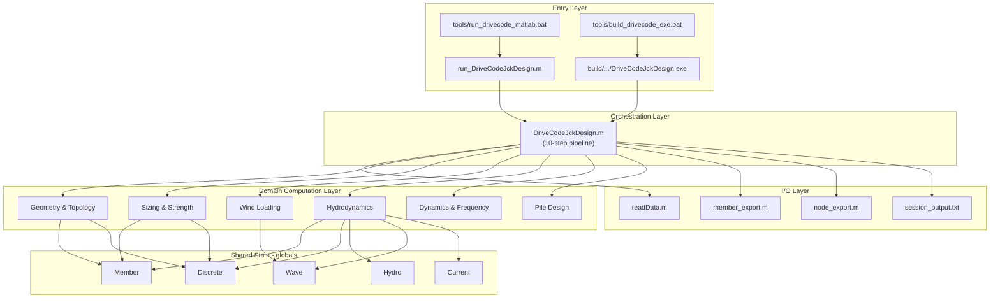
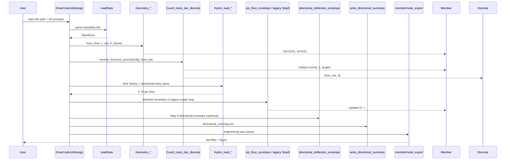
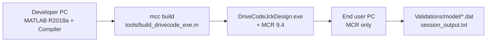

# System Architecture

> **Document basis:** Derived from repository layout and `modules/` dependency analysis.  
> **Related:** [REQUIREMENTS.md](REQUIREMENTS.md) · [DESIGN.md](DESIGN.md) · [USER_MANUAL.md](USER_MANUAL.md)

---

## 1. Architectural Overview

The system follows a **monolithic MATLAB script architecture** with a **procedural pipeline** orchestrated by a single driver function. Computation is decomposed into **stateless-ish functions** that communicate through **global structs**, not through object-oriented domain models or a plugin framework.



---

## 2. Layer Description

### 2.1 Entry layer

| Component | Role |
|-----------|------|
| `run_DriveCodeJckDesign.m` | Adds `modules/` to path; calls driver with no args |
| `tools/run_drivecode_matlab.bat` | Headless MATLAB invocation from repo root |
| `tools/build_drivecode_exe.m` | Invokes `mcc` to compile driver + dependencies |
| `DriveCodeJckDesign.exe` | Deployed runtime; same logic, requires MCR 9.4 |

### 2.2 Orchestration layer

`DriveCodeJckDesign.m` is the **single composition root**. It:

- Owns the 10-step workflow sequencing.
- Maps input struct fields to local variables and globals.
- Embeds wind load formulas inline (ETM/EOG/EWM).
- Contains ULS combination logic and resize loops inline.
- Hardcodes model I/O paths and several design constants.

There is **no separate service layer** or event bus — control flow is linear with nested loops.

### 2.3 Domain computation layer

Functions in `modules/` implement specialized physics/geometry. They are grouped by concern (see §5). Most accept numeric arguments; many **read/write globals** instead of returning updated structures.

### 2.4 I/O layer

| Direction | Mechanism |
|-----------|-----------|
| Input | Text file → `readData` → MATLAB struct |
| Human input | MATLAB `input()` for file path and cross-sections |
| Log | MATLAB `diary` → `Validations/model/session_output.txt` |
| Geometry export | Tab-separated `.dat` via `member_export` / `node_export` |
| Visualization | MATLAB `figure` in `node_export`, `cord_Cal` |

### 2.5 Validation layer (parallel to runtime)

`Validations/model/` — integrated workflow replicas.  
`Validations/modulus/` — isolated module tests.  

Not invoked automatically by the driver; run manually for verification.

---

## 3. Shared State Model (Globals)

The runtime relies on five primary global containers:

### 3.1 `Member` — structural bar model

Populated by geometry functions; enriched by discretization and sizing.

| Field group | Fields | Set by |
|-------------|--------|--------|
| End coordinates | `X0,Y0,Z0`, `Xt,Yt,Zt` | `Geometry_jacket_*`, then rotated by `coordinate_trans` |
| Section | `D`, `t` | `Diameter_thickness_ini/update` |
| Geometry meta | `L`, `fai_y`, `cita_x`, `cx,cy,cz` | `Coord_trans_bar_discrete` chain |

Internal coordinate convention: **Y is vertical** (mudline/platform elevation), X–Z plan.

### 3.2 `Discrete` — hydrodynamic discretization

| Field | Meaning |
|-------|---------|
| `Num_ele(i)` | Number of Morison elements along bar `i` |
| `dL(i)` | Element length |

Target segment length: global `dL_ele_target = 3.0 m`.

### 3.3 `Hydro` — fluid coefficients

| Field | Source |
|-------|--------|
| `density`, `cd`, `cm` | Input file |

### 3.4 `Wave` — sea state (mutable during run)

| Field | Usage |
|-------|-------|
| `S` | Water depth for hydro |
| `T`, `h`, `k` | Wave period, height, wavenumber — **updated per load case** in Step 4–5 |

### 3.5 `Current` — current profile

| Field | Source |
|-------|--------|
| `U_ss0`, `U_ns0`, `h_ref` | Input file |

### 3.6 Optional debug flag

`global debug` — when `debug==1`, many functions validate input ranges and emit detailed errors. Not set by main driver (defaults unset/false).

---

## 4. Data Flow



**Key observation:** `Wave.T/h/k` is mutated in-place between load cases. The driver must not parallelize floor/load loops without isolating state.

---

## 5. Module Map

### 5.1 By architectural concern

| Concern | Modules | Count |
|---------|---------|-------|
| Driver / config | `DriveCodeJckDesign`, `readData`, `build_design_config`, `resolve_step5_uls_path`, `resolve_step9_deflection_path`, `step5_floor_indices` | 7 |
| Directional loads | `direction_scenarios`, `combine_plan_loads`, `uls_member_demands`, `uls_floor_envelope`, `run_step5_directional_floor`, `hydro_load_directional_max`, `directional_deflection_envelope`, `compute_towertop_deflection_case`, `build_directional_summary`, `write_directional_summary`, `resize_member_sections`, `resolve_structure_azimuth`, `get_floor_leg_positions` | 14 |
| Jacket geometry | `Geometry_jacket_3f/4f`, `height_wd_jac_floor_*`, `Bar_num_determine`, `set_*_ID_per_floor`, `get_bar_array_for_floor`, `get_width_of_floor_*`, `get_center_hydro_load_for_floor_*`, `checkbarnumber` | 14 |
| Coordinate / discretization | `coordinate_trans`, `Coord_trans_bar_discrete`, `Member_length`, `Member_fai_y`, `Member_cita_x`, `Direction_bar`, `Discrete_bar` | 7 |
| Sizing / strength | `Diameter_thickness_ini/update`, `sigma_allowable`, `Weight_jacket`, `Diameter_pile` | 5 |
| Wind | `Moment_Jac_wind` (+ inline thrust in driver) | 1 + inline |
| Hydrodynamics | `wave_number`, `surface_elevation`, `Vel_fluid_particle`, `Vel_resolve`, `ACC_*`, `Current_vel`, `Hydro_member1`, `Hydro_member_drag/inertia_only`, `Hydro_structure`, `Hydro_load_timehistory`, `Hydro_load_max`, `Hydro_load_1and50yrs`, `hydro_load_directional_max`, `resolve_wave_beta_propagation`, `wave_phase_x_eff` | 17 |
| Dynamics | `intergral_mode_shape`, `Distribute_mass_jacket` | 2 |
| Export / viz | `member_export`, `node_export`, `cord_Cal` | 3 |

**Total:** 60+ production `.m` files in `modules/` (excluding `.asv` autosaves).

### 5.2 Dependency direction

```
DriveCodeJckDesign
  ├── readData, build_design_config
  ├── direction_scenarios → combine_plan_loads → uls_member_demands → uls_floor_envelope
  ├── run_step5_directional_floor, resize_member_sections
  ├── directional_deflection_envelope, write_directional_summary
  ├── Geometry_jacket_* → Member
  ├── Diameter_thickness_* → Member
  ├── Coord_trans_bar_discrete
  │     ├── coordinate_trans
  │     ├── Member_length, Member_fai_y, Member_cita_x, Direction_bar
  │     └── Discrete_bar → Discrete
  ├── Moment_Jac_wind
  ├── Hydro_load_timehistory → Hydro_structure → Hydro_member1 → (Vel/ACC/wave/current chain)
  ├── Hydro_load_1and50yrs
  ├── sigma_allowable, Weight_jacket, Diameter_pile
  ├── intergral_mode_shape, Distribute_mass_jacket
  └── member_export, node_export, cord_Cal
```

**No reverse dependencies** from modules back to the driver (except globals).

---

## 6. Coordinate Systems

Two coordinate systems coexist:

| System | Used in | Axes |
|--------|---------|------|
| **Internal** | `Member`, hydro integration, geometry generation | X, **Y-up**, Z |
| **Engineering export** | `.dat` files, plots | X, **Z-up** (SWL=0), Y = former Z |

Transform at export:

```
X_eng = X_int
Y_eng = Z_int
Z_eng = Y_int − water_depth
```

Documented in `member_export.m` / `node_export.m` headers.

---

## 7. Deployment Architecture



Build bundles all dependent `.m` functions reachable from the driver. Runtime strings may be sanitized via `tools/sanitize_runtime_strings.py` before build.

---

## 8. Cross-Cutting Concerns

| Concern | Approach | Limitation |
|---------|----------|------------|
| Configuration | Flat input file + hardcoded constants | No runtime config file |
| Logging | `fprintf` + `diary` | No structured log levels |
| Error handling | `error()` with IDs in driver; generic in modules | Fail-fast, no recovery |
| Testing | Manual validation scripts | No automated test runner |
| Internationalization | Mixed EN/ZH comments; ASCII sanitize option | Not i18n-ready |
| Concurrency | Single-threaded MATLAB | Globals prevent parallel runs in one workspace |

---

## 9. Repository Topology

```
jacket_design_5MW/
├── run_DriveCodeJckDesign.m      # Entry (dev)
├── modules/                       # Domain + driver (authoritative runtime)
├── Validations/                   # Verification (non-runtime)
├── tools/                         # Build & maintenance
├── build/DriveCodeJckDesign/      # Compiler artifacts
├── Docs/                          # Documentation
└── Backup/                        # Historical code (excluded from architecture)
```

**Authoritative runtime path:** `modules/DriveCodeJckDesign.m` only.  
`Backup/` and `Validations/model/DriveCode_250401.m` are **not** part of the active architecture.

---

## 10. Architecture Decision Records (Inferred)

| Decision | Rationale (inferred) | Trade-off |
|----------|----------------------|-----------|
| Global structs for `Member`/`Wave`/… | Rapid MATLAB prototyping; matches legacy script style | Hard to test, not thread-safe |
| Single driver owns ULS loops | Keeps workflow visible in one file | 630+ line function, high coupling |
| Fixed output to `Validations/model` | Reproducible validation artifacts | Poor multi-project usability |
| Separate `modulus` tests | Faster module debugging | Drift from driver API (13 FAIL) |
| MATLAB Compiler deployment | Share tool without full MATLAB license | Rebuild required on every change |
| 3f/4f split geometry functions | Different bay layouts | Duplicated coordinate logic |

---

## 11. Future Architecture Options (Recommendations)

Not implemented — listed for maintainers:

1. **Replace globals** with a single `model` struct passed through the call chain.
2. **Extract load cases** into `WindLoadCase.m` / `WaveLoadCase.m` classes or structs.
3. **Configuration object** for paths, constants (`Gs`, resize deltas, directional modes) — partially delivered via `build_design_config.m`.
4. **Test harness** (`matlab.unittest`) invoking modulus scripts in CI.
5. **Split driver** into step functions: `step02_geometry()`, `step05_uls()`, etc.

See [CODE_REVIEW.md](CODE_REVIEW.md) for prioritized remediation.
