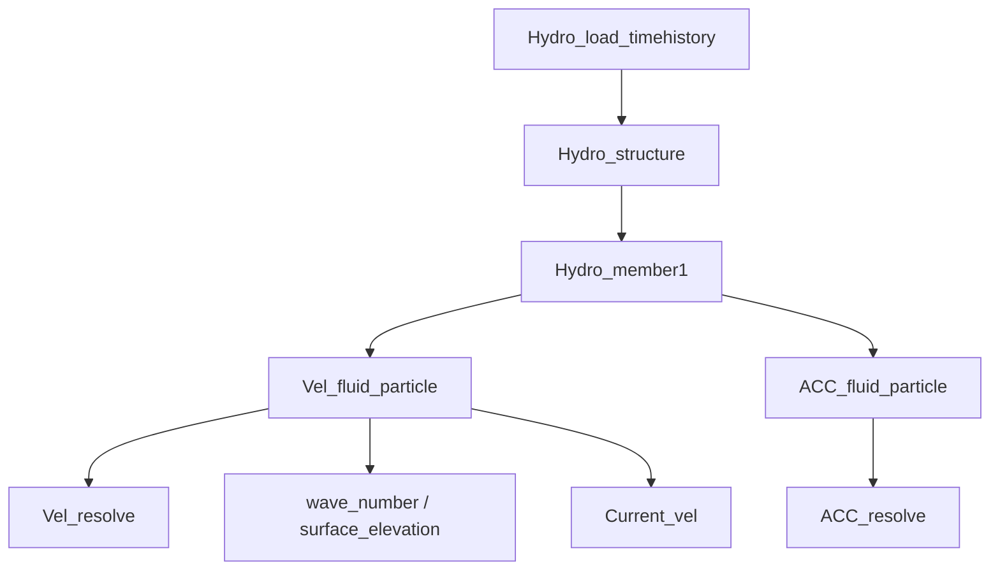

# Detailed Design

> **Document basis:** Step-by-step design extracted from `DriveCodeJckDesign.m` and called modules.  
> **Theory authority:** SCI paper — see [THEORY_REFERENCE.md](THEORY_REFERENCE.md) for equation mapping.  
> **Related:** [ARCHITECTURE.md](ARCHITECTURE.md) · [REQUIREMENTS.md](REQUIREMENTS.md) · [CODE_REVIEW.md](CODE_REVIEW.md)

---

## 1. Design Overview

The design is a **sequential preliminary design pipeline** for a **4-leg offshore jacket** supporting a **5 MW-class** wind turbine. Each step consumes numeric parameters and global state left by prior steps. There is no feedback from Step 10 back to Step 2 (no global optimization loop).


---

## 2. Step 1 — Input Loading and Preprocessing

### 2.1 Input parsing

**Function:** `readData(fileName)`

```
FOR each line after header:
  IF matches regex (number, identifier, comment):
    dataStruct.(identifier) = number
  ELSE:
    WARNING(unmatched line)
```

### 2.2 Derived quantities

| Symbol | Formula | Notes |
|--------|---------|-------|
| `m_tower_eq` | `m_t / h_Tower` | kg/m equivalent line mass |
| `MTower` | `h_Tower × 3730` | Empirical total tower mass (kg) |
| `Zplatform` | `water_depth + Hm50 + 0.2·Hs50` | Platform elevation reference (m) |

Globals initialized: `Hydro.density/cd/cm`, `Wave.S`, `Current.U_ss0/U_ns0/h_ref`.

---

## 3. Step 2 — Jacket Global Geometry

### 3.1 Primary dimensions

| Symbol | Formula |
|--------|---------|
| `h_Jacket` | `ceil(Zplatform)` |
| `L_bottom` | `L_top + √2 · h_Jacket · tan(av)` |
| `m` | `(L_bottom / L_top)^(1/Num_floor)` |
| `h1` | `h_Jacket · (m−1) / (m^Num_floor − 1)` |
| `l1` | `m · L_top` |
| `sitah` | brace angle from geometry (see driver L98) |

> **Note:** Legacy validation script `DriveCode_1.m` uses `L_bottom = L_top + 2·h_Jacket·tan(av)` — a **design divergence** documented in [CODE_REVIEW.md](CODE_REVIEW.md).

### 3.2 Bay layout

- **3-bay:** `height_wd_jac_floor_3f` → `h2,h3,l2,l3`
- **4-bay:** `height_wd_jac_floor_4f` → `h2,h3,h4,l2,l3,l4`

**Validation:** bottom computed width must match `L_bottom` within **0.05 m**.

### 3.3 Member topology

**Bar count:**

```
Num_bar = (Num_pile + 2·Num_pile) · Num_floor
        = 3 · Num_pile · Num_floor
```

For default `Num_pile=4`, `Num_floor=4` → **48 bars**.

**Geometry builder:** `Geometry_jacket_3f` or `Geometry_jacket_4f` writes all `Member.X0/Y0/Z0/Xt/Yt/Zt`.

Coordinate convention in geometry: **Y vertical**, plan in X–Z, symmetric about origin.

### 3.4 Leg/brace indexing

`set_leg_ID_per_floor(Num_floor, Num_pile)` → matrix `(floor × pile)` of leg member IDs.  
`set_brace_ID_per_floor` → brace IDs similarly.  
`get_bar_array_for_floor(i, ...)` returns all bar IDs contributing to floor `i` hydrodynamics.

---

## 4. Step 3 — Initial Cross-Section Sizing

### 4.1 Frequency target

```
f_fb_target = n_max · 2π/60 · 1.1 / (2π) = n_max · 1.1 / 60   [Hz]
```

Also computed (informational): `f_3p_min`, `f_1p_max` from `n_min`, `n_max`.

### 4.2 Tower stiffness (thin-wall taper approx.)

```
t_tower = m_t / (steel_density · π · h_Tower · Dt_Tower)
I_Tower_top = π · D_Tower_top³ · t_tower / 8
fq = f(D_Tower_bottom / D_Tower_top)   % taper correction
EI_tower = E · I_Tower_top · fq
```

### 4.3 Target jacket stiffness from frequency

```
EI_tj_target = (2π·f_fb_target)² · (0.243·m_JT_eq·h_total + M_rna) · h_total³ / 3
kai = stiffness split ratio from tower/jacket share
EI_Jacket = EI_tower / kai
Itopj = EI_Jacket / (fm1 · E)
Aleg = Itopj / L_top²
Abrace = 0.2 · Aleg
```

Initial OD estimates (thin pipe approx.):

```
D_leg_ini  from Aleg with t/D ≈ 1/25
D_brace_ini = 0.4 · D_leg_ini
```

### 4.4 User interaction

User must enter `D_leg`, `t_leg`, `D_brace`, `t_brace` at prompt.  
`Diameter_thickness_ini` assigns these to all legs/braces via floor ID maps.

---

## 5. Step 4 — Environmental Loads

### 5.1 Wind load cases (inline in driver)

| Case | Thrust basis | Key inputs |
|------|--------------|------------|
| **ETM** | `F = ½ ρ_air Ar Ct (U_r + u_etm)²` | `Ct = 3.5(2U_r+3.5)/U_r²`, turbulence σ from `I_ref`, `Lk`, 1P filter |
| **EOG** | `F = ½ ρ_air Ar Ct (U_r + u_eog)²` | `u_eog = min(1.35|U_e1−U_r|, 3.33σ/(1+0.1D/L))` |
| **EWM** | `F = ½ ρ_air Ar Ct1 (U_r + U_e*)²` | **`Ct1 = 0.052` hardcoded**; `U_e50`, `U_e1` from `U_ref`, hub height |

Wind moment at floor reference elevation:

```
M_wind = F_wind · (h_Tower + h_Jacket − y0_position)    [Moment_Jac_wind.m]
```

### 5.2 Wave statistics

| Return period | Significant height | Extreme height | Period |
|---------------|-------------------|----------------|--------|
| 2-yr (EOG/ETM) | `Hs2` (input) | `Hm2` from `Hs2`, `N2` | `Tm2` |
| 1-yr | `Hs1 = 0.8 Hs50` | `Hm1` | `Tm1` |
| 50-yr | — | `Hm50` (input) | `Tm50` |

**DAF** (dynamic amplification):

```
DAF = 1 / √((1 − 1/(Tm·f_fb))² + (2·0.05/(Tm·f_fb))²)
```

Computed for 1-yr, 2-yr, 50-yr periods.

### 5.3 Hydrodynamic discretization

```
resolve_structure_azimuth(cfg)  →  psi for Coord_trans_bar_discrete
dL_ele_target = 3.0 m
Coord_trans_bar_discrete(psi, Num_bar):
  - rotate each member end about Y by structure azimuth
  - compute length, orientation angles
  - split into Discrete.Num_ele segments ~3 m
```

In **`legacy_pesai`** mode, `psi` comes from `pesai_legacy` (default 45°). In paper modes (`auto_envelope`, `single_direction`), `psi_site` sets installation azimuth; wind/wave directions `β₁`, `β₂` are applied separately in load combination (Eq. 48).

**Logging starts:** `diary(Validations/model/session_output.txt)`.

---

## 6. Step 5 — ULS Member Strength Design

Step 5 dispatches by `load_direction_mode` (see `resolve_step5_uls_path.m`):

| Mode | Path | Demand model |
|------|------|--------------|
| `auto_envelope` / `single_direction` | `run_step5_directional_floor.m` → `uls_floor_envelope.m` | Paper Eqs (48)–(52); envelope over direction cases × ULS wind/sea pairs |
| `legacy_pesai` | Inline scalar loop in driver | Original `M`, `H`, `V1`, `Fb` with `cosd(pesai)` brace term |

### 6.1 Per-floor loop (paper modes)

For each floor index from `step5_floor_indices(Num_floor)`:

1. **Select bars:** `Num_bar_array = get_bar_array_for_floor(i, ...)`
2. **Reference elevation:** `Y0_position(i)`, leg positions via `get_floor_leg_positions`
3. **Envelope:** loop direction scenarios (D1–D4 or single pair) × environment cases (ETM+Hm2, EOG+Hm2, EWM_50+Hm50, EWM_1+Hm1)
4. **Demands:** `combine_plan_loads` + `uls_member_demands` → governing leg compression/tension and brace axial
5. **Resize:** `resize_member_sections` using configured `delta_D_*`, `delta_t_*` from input

### 6.2 Per-floor loop (legacy_pesai)

For each floor `i = 1..Num_floor` (via `step5_floor_indices`):

1. **Select bars:** `Num_bar_array = get_bar_array_for_floor(i, ...)`
2. **Reference elevation:** `Y0_position(i)`, `Width(i)` from 3f/4f helpers
3. **Wind moments:** `M_etm`, `M_eog`, `M_ewm_6_1`, `M_ewm_6_3`
4. **Hydrodynamic time histories** (100 s, dt=0.1):
   - 2-yr sea (`Hm2`, `Tm2`) → `F2`, `M2`
   - 1-yr amplified → stored in `F_1y_all`, `M_1y_all`
   - 50-yr amplified → stored in `F_50y_all`, `M_50y_all`
5. **Combined hydro via** `Hydro_load_1and50yrs` → `F1,M1,F50,M50,F2,M2`

### 6.2 Demand/capacity

**Weight:**

```
W_jk = Weight_jacket(subset, steel_density, water_density, y0)
Wnet = W_jk + (Mtp + MTower + M_rna) · g
```

**Governing factored moment:**

```
M = 1.3 · max( M_etm+M2, M_eog+M2, M_ewm_6_1+M50, M_ewm_6_3+M1 )
```

**Leg compression (leg 1 representative):**

```
V1 = (1/Width) · (M/√2) + 1.3·Wnet/4
```

**Leg 4 tension (floor 4 only, for piles):**

```
V4 = (1/L_bottom) · (M/√2) − 0.9·Wnet/4
```

**Horizontal resultant per leg:**

```
H = 1.3 · max( (F_etm+F2)/4, (F_eog+F2)/4, (F_ewm_6_1+F50)/4, (F_ewm_6_3+F1)/4 )
Fb = H / (cos(sitah) · cos(pesai))     % brace axial
```

### 6.3 Capacity — `sigma_allowable.m`

Steel: `fy = 355 MPa`, `E = 210 GPa`.

```
Cc = √(2π²E/fy)
IF k·L/r < Cc:  column curve (inelastic)
ELSE:            Euler-type 12π²E / (23·(kL/r)²)
F_allowable = (σ_allow · A) / 1.15 · 1e6   [N]
```

Effective length factors: **`k_leg = 1.0`**, **`k_brace = 0.8`**.

### 6.4 Resize iteration

**Paper modes** (`resize_member_sections.m`):

```
WHILE governing demand > capacity:
  IF leg governs:  D_leg += delta_D_leg;  t_leg += delta_t_leg
  IF brace governs: D_brace += delta_D_brace; t_brace += delta_t_brace
  UPDATE Member via Diameter_thickness_update
  RECOMPUTE hydro loads and demands
```

**Legacy mode** retains fixed absolute jumps (`D_leg = 1.2`, `D_brace = 0.6`) for regression comparison only.

Store converged `D_legs(i)`, `t_legs(i)`, `D_braces(i)`, `t_braces(i)`.

---

## 7. Step 6 — Pile Sizing

**Function:** `Diameter_pile(V4, L_pile, wgh_soil, fs_limit, interface_angle, K0)`

Design approach:

1. Iterate pile OD from `2.0 + 0.1·j` m, `j = 1..200`.
2. For each depth slice (50 points along `L_pile`):
   - Vertical stress `σ_v = wgh_soil · depth`
   - Shaft friction `f = K0 · tan(φ) · σ_v`, capped at `fs_limit`, zero near surface within `1.25D`
3. Integrate circumferential friction → resultant `R`.
4. Select first `D_pile` where `R > V4` (tension demand).

Wall thickness:

```
t_pile = ceil(D_pile·1000/100 + 6.35) / 1000
```

Hardcoded: `interface_angle = 29°`, `K0 = 1.0`.

---

## 8. Step 7 — Natural Frequency

### 8.1 Jacket flexibility

Recompute `EI_Jacket` from converged leg areas `Ac(1..4)` using closed-form expression (driver L531 — log/terms in leg width variation).

### 8.2 Combined system

```
EI_JacketTower = f(EI_tower, EI_Jacket, fai, h_Jacket, h_Tower)
m_Jacket_eq = Distribute_mass_jacket(Num_bar, steel_density, h_Jacket)
m_JT_eq = mode-shape-weighted average of jacket + tower line masses
f_fb = (1/2π) · √( 3·EI_JacketTower / ((0.243·m_JT_eq·h_total + M_rna)·h_total³) )
```

### 8.3 Soil spring

```
Gs = 15e6        (hardcoded)
k_pile = 2π · L_pile · Gs / 4
K_v = 2 · k_pile
K_R = K_v · L_bottom² · (α/(1+α))    , α = 1
tao = K_R · h_total / EI_JacketTower
C_J = √( tao / (tao + 3) )
f_0 = C_J · f_fb
```

---

## 9. Step 8 — Frequency Sensitivity

Scale `Gs` by **1.30** and **0.70**; recompute `k_pile`, `K_R`, `tao`, `C_J`, `f_0`.  
Report only — no acceptance criteria enforced in code.

---

## 10. Step 9 — Tower-Top Deflection

When `enable_directional_deflection = 1` and mode is not `legacy_pesai`, Step 9 uses `directional_deflection_envelope.m` to evaluate D1–D4 (or single direction) with **1-yr NTM** wind + 1-yr wave, selecting the governing deflection case.

**Legacy path:** scalar NTM + 1-yr wave deflection (unchanged behaviour for regression).

Uses bottom-floor hydro reference and last converged member properties from Step 5.

Components (legacy single-case path):

1. **Wave:** 1-yr time history max → simplified cantilever deflection using `K_R`, `EI_Jacket`.
2. **Wind (NTM-like):** `u_ntm = 1.28·σ_ntm,filtered` → `F_ntm` → deflection with `K_R`, `EI_JacketTower`.

```
delt_towertop = delt_wind + delt_wave
```

After Step 9, `write_directional_summary.m` emits `directional_summary.txt` with governing ULS and deflection metadata.

No explicit pass/fail limit in code.

---

## 11. Step 10 — Geometry Export

Paths (hardcoded):

```
Validations/model/jacket_elements.dat
Validations/model/node_coordinates.dat
```

**Export transform:** internal → engineering (see [ARCHITECTURE.md §6](ARCHITECTURE.md)).

`cord_Cal` prints member list and draws 3-D plot.

---

## 12. Hydrodynamic Subsystem Design

### 12.1 Morison pipeline



For each time step `t` and each bar in the analysis group:

1. Loop discrete elements along member.
2. Compute fluid velocity/acceleration (wave + current).
3. Project to member normal/tangential (`Vel_resolve`, `ACC_resolve`).
4. Integrate drag (`cd`) and inertia (`cm`) forces along member length.
5. Sum contributions → `Ftx, Fty, Ftz, Mtx, Mtz` about reference elevation.

### 12.2 Current profile — `Current_vel.m`

- Surface layer: power-law `U_ss(z) = U_ss0 · (z/d)^(1/7)`
- Near-bed layer (when `z ≥ d − h_ref`): linear decay of `U_ns0`

---

## 13. Key Data Structures Summary

### 13.1 Input struct (`readData` output)

Flat scalar struct — field names match identifiers in `inputdata.dat`.

### 13.2 Floor indexing maps

```
LegidPfloor(floor, pile)   → Member index
BraceidPfloor(floor, brace) → Member index
```

Legs numbered sequentially by floor: `(i−1)·Num_pile + j`.

### 13.3 Step 5 result vectors (local)

| Array | Size | Content |
|-------|------|---------|
| `D_legs`, `t_legs` | 4×1 | Converged leg section per floor |
| `D_braces`, `t_braces` | 4×1 | Converged brace section per floor |
| `F_2_all`, `M_2_all` | 4×1 | 2-yr hydro maxima |
| `F_1y_all`, `M_1y_all` | 4×1 | 1-yr DAF-amplified |
| `F_50y_all`, `M_50y_all` | 4×1 | 50-yr DAF-amplified |

---

## 14. Interface Contracts (Module API)

| Function | Inputs | Outputs | Side effects |
|----------|--------|---------|--------------|
| `readData(file)` | path | struct | — |
| `Geometry_jacket_4f(...)` | scalars | — | fills `Member` coords |
| `Coord_trans_bar_discrete(ψ, N)` | azimuth, bar count | — | updates `Member`, `Discrete` |
| `Hydro_load_timehistory(t0,t1,dt,bars,y0)` | time range, bar list | F, M, t | reads globals |
| `sigma_allowable(k,L,r,A)` | column params | F [N] | prints short/long |
| `Diameter_pile(P,L,γ,fs,φ,K0)` | tension, soil | D_pile | — |
| `member_export(path,N,wd)` | path, count, depth | — | writes file |

---

## 15. Known Design Limitations

1. **`legacy_pesai`** branch still uses fixed resize jumps (`D_leg=1.2`, `D_brace=0.6`); paper modes use configured increments.
2. **`Gs`, `Ct1`** remain hardcoded in driver; directional azimuth is configurable via input (`psi_site`, `beta_*`, `pesai_legacy`).
3. **Single-leg demand model** (leg 1 compression, leg 4 tension) — not full 3-D frame analysis.
4. **Empirical tower mass** may disagree with `m_t` from input.
5. **No explicit buckling check** beyond axial `sigma_allowable` column formula.

See [CODE_REVIEW.md](CODE_REVIEW.md) for audit findings and remediation priority.
