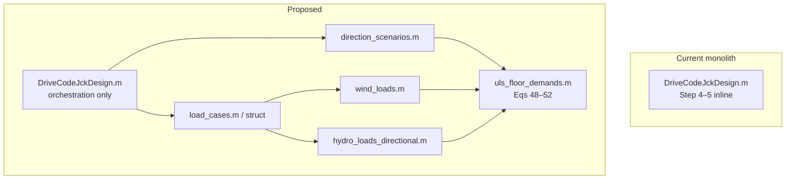

# Implementation Plan: Multi-Direction Load Combinations (Paper §2.5)

> **Status:** Hybrid plan approved by project owner; no MATLAB source code changes yet  
> **Authority:** Xi R. et al. (2026), §2.5 — [THEORY_REFERENCE.md](THEORY_REFERENCE.md)  
> **Date:** 2026-05-21

---

## 1. Objective

Implement a **hybrid directional-load workflow** for paper §2.5:

- Default mode: **`auto_envelope`** — automatically evaluate the four representative paper direction cases D1–D4.
- Advanced mode: **`single_direction`** — evaluate one user-specified wind/wave direction pair for debugging, sensitivity studies, or paper reproduction.
- Regression mode: **`legacy_pesai`** — preserve the current `pesai`-based behaviour only for comparison with old results.

The first implementation shall cover the four paper representative direction cases only. It shall **not** implement full-angle scanning (for example `0:5:90`) in the first version.

**Success criteria (proposed):**

1. Step 5 evaluates direction cases **D1–D4** in `auto_envelope` mode and envelopes governing leg/brace demands per floor.
2. Step 9 evaluates directional tower-top deflection envelopes in the same mode.
3. `single_direction` mode accepts explicit `β₁` (wind) and `β₂` (wave/current) inputs.
4. `legacy_pesai` mode preserves today's `pesai`-based behaviour for regression only.
5. Output logs record the controlling direction case, controlling wind/wave angles, controlling environment case, and governing demand values.

---

## 2. Current State vs Paper §2.5

### 2.1 Conceptual gap

| Concept | Paper §2.5 | Current code |
|---------|------------|--------------|
| Wind direction | `β₁` — dominant wind direction in plan | Scalar thrust `F_etm` etc.; no `β₁` |
| Wave direction | `β₂` — wave/current propagation in plan | Wave fixed along **+X** (`Vel_fluid_particle`: `cos(kx−ωt)`) |
| Structure orientation | Jacket plan relative to global axes (Fig. 8–10) | `pesai` rotates **all member coordinates** in Step 4 |
| Load combination | Eq. (48): `Fx`, `Fy`, `Mx`, `My` from `β₁`, `β₂` | Scalar `M`, `H`; `V1 = M/(√2·Width)` |
| Scenarios | Four cases (a)–(d) | One implicit case |
| Brace axial | Eq. (52): `FNb = Fsx/cos θh`, `Fsx = Fx/4` | `Fb = H/(cos(sitah)·cos(pesai))` |
| Leg axial | Eq. (51): `(Mx+My)/(2Li) − FN,g` | `V1 = M/(√2·Width) + 1.3·Wnet/4` |

**Critical observation:** `pesai` today **conflates** (1) site/jacket azimuth, (2) wave–wind misalignment, and (3) brace resolution geometry. Paper §2.5 treats **load directions** (`β₁`, `β₂`) independently of the truss idealization.

### 2.2 What already supports multi-direction (partially)

| Module | Already vectorial? | Notes |
|--------|-------------------|-------|
| `Hydro_structure` | Yes — `Ftx,Fty,Ftz,Mtx,Mtz` | Summed in member/global axes |
| `Hydro_load_max` | Per-axis `max(abs(·))` | Not equivalent to rotating wave then taking resultant |
| `Hydro_load_1and50yrs` | **No** — uses only `Ftx`, `Mtz` | Drops `Fty`, `Mtx` |
| `Moment_Jac_wind` | Scalar moment about vertical | No `β₁` decomposition |
| `Vel_fluid_particle` | Wave along +X only | Needs propagation angle `β₂` |

### 2.3 Four paper scenarios (approved first-version definition)

Reference structure plan: **leg 1 in +X quadrant** (see paper Figs 8–10). Angles measured **counter-clockwise from +X** in the horizontal plane (mapped to code **X–Z** plane, Y vertical).

| ID | Paper wording | First-version definition | Notes |
|----|---------------|--------------------------|-------|
| **D1 / (a)** | Co-directional wind and wave | `β₁=0°`, `β₂=0°` | Wind and wave along the structure reference axis |
| **D2 / (b)** | 90° directional discrepancy | `β₁=0°`, `β₂=90°` | Wind and wave/current perpendicular |
| **D3 / (c)** | 45° directional offset | `β₁=0°`, `β₂=45°` | Wind and wave/current differ by 45° |
| **D4 / (d)** | Both at 45° to structure | `β₁=45°`, `β₂=45°` | Closest to current `pesai=45°` intent |

This set deliberately limits the first version to the four representative cases discussed in the paper. Because the current design uses one cross-section per layer, symmetric directions outside 0–90° are expected to move the controlling leg/brace location rather than require different layer dimensions. Full angular sweeps may be added later if validation shows the four-case set is insufficient.

---

## 3. Approved Hybrid Scope

### 3.1 Mode 1 — `auto_envelope` (default)

Default production mode. The code automatically evaluates:

- Direction cases D1–D4 from §2.3.
- Existing ULS environment combinations:
  - `ETM + Hm2`
  - `EOG + Hm2`
  - `EWM_50 + Hm50`
  - `EWM_1 + Hm1`
- Directional tower-top deflection in Step 9.

The envelope result controls member resizing and final reporting.

### 3.2 Mode 2 — `single_direction`

Advanced/debug mode. The user provides one direction pair:

```text
β₁ = beta_wind
β₂ = beta_wave
```

The code evaluates only that pair. This mode supports:

- Debugging and unit verification.
- Reproducing one paper direction case.
- User-driven parametric studies.

### 3.3 Mode 3 — `legacy_pesai`

Regression mode only. Preserves the current implementation style:

- Wave remains fixed along global +X.
- Structure is rotated by `pesai`.
- Current scalar Step 5 shortcuts may be used for old-result comparison.

This mode is not the recommended design mode after directional ULS is implemented.

### 3.4 Paper-faithful implementation scope

1. Implement Eq. (48)–(52) in a dedicated module.
2. Add wave propagation angle `β₂` into hydro chain.
3. Represent wind as magnitude + `β₁` (or `Fx,Fy` components).
4. Envelope over D1–D4 **and** existing wind/sea ULS combinations.
5. Include Step 9 directional deflection envelope.
6. Fix ULS resize increments in the same implementation effort.

### 3.5 Deferred scope

- Full angular scanning, such as `β = 0:5:90`.
- Probabilistic directional weighting.
- Automated optimization over continuous wind-wave misalignment.
- Parallel (`parfor`) implementation, unless required after profiling.

---

## 4. Coordinate Convention Contract

Establish one documented mapping (to be added to `THEORY_REFERENCE.md` after approval):

| Paper (Fig. 1) | Code internal | Code export |
|----------------|---------------|-------------|
| x (east) | **X** | **X** |
| y (north) | **Z** | **Y** |
| z (vertical) | **Y** | **Z** (SWL=0) |

**Load direction angles `β₁`, `β₂`:** defined in the **horizontal plane (X–Z)**, CCW from +X.

**Structural azimuth `psi_site`:**

- Optional fixed installation angle of the jacket relative to the site/global coordinate system.
- It is **not** a wind direction and **not** a wave direction.
- Default in paper mode: `psi_site = 0°`.
- `legacy_pesai` keeps the old `pesai` meaning for regression only: fixed global wave direction plus rotated structure.

---

## 5. Target Architecture

### 5.1 High-level structure



### 5.2 New / refactored modules (proposed files)

| File | Responsibility |
|------|----------------|
| `modules/direction_scenarios.m` | Return D1–D4 for `auto_envelope` or one user case for `single_direction` |
| `modules/combine_plan_loads.m` | Eq. (48): `[Fx,Fy,Mx,My]` from scalar wind/hydro resultants + angles |
| `modules/uls_member_demands.m` | Eqs (49)–(52): `FN,g`, `V1`, `V4`, `Fb` for layer `i` |
| `modules/uls_floor_envelope.m` | Loop direction cases × ULS wind-wave pairs; return governing demands and controlling metadata |
| `modules/wave_kinematics_at_angle.m` | Wrapper or extend `Vel_fluid_particle` with `beta_wave` |
| `modules/directional_deflection_envelope.m` | Step 9 directional tower-top deflection envelope and controlling case metadata |
| `modules/config_design.m` | Centralize factors: `1.3`, `k_leg`, `k_brace`, mode flags, resize increments |

### 5.3 Extended global / context struct (replace implicit globals long-term)

**Phase 1 (minimal disruption):** add fields to existing globals:

```matlab
Wave.beta_propagation   % β₂ for current hydro run
LoadCase.beta_wind      % β₁
LoadCase.scenario_id    % 'a'|'b'|'c'|'d'
```

**Phase 2 (recommended follow-up):** single `model` struct passed through calls (see ARCHITECTURE.md §11).

### 5.4 Step 5 control flow (target)

```
FOR each floor i = 1 .. Num_floor
  Initialize D/t for floor
  WHILE not ULS satisfied
    governing = empty
    FOR each direction scenario s in active mode
      FOR each ULS pair (wind_case, sea_case)  % ETM+F2, EOG+F2, EWM50, EWM1, etc.
        Compute Faero, Maero (scalar, wind_case)
        Compute Fhydro, Mhydro (scalar or vector, sea_case, beta_wave(s))
        [Fx,Fy,Mx,My] = combine_plan_loads(...)
        demands = uls_member_demands(Fx,Fy,Mx,My, Wnet, Li, sitah, ...)
        governing = max_envelope(governing, demands, metadata)
      END
    END
    IF governing leg/brace <= capacity
      BREAK
    ELSE
      increment D/t using input-configured deltas
      update Member, recompute hydro if diameter changed
    END
  END
END
```

---

## 6. Hydrodynamics: Wave Direction Implementation Options

### Option H1 — Rotate wave phase in kinematics (**recommended**)

In `Vel_fluid_particle` / `ACC_fluid_particle`, replace `x` in `k·x − ωt` with:

```
x_eff = x · cos(β₂) + z · sin(β₂)    % code X–Z plane
```

- **Pros:** Physically consistent Morison integration at arbitrary propagation angle.
- **Cons:** Must re-run time history for each distinct `β₂`.

### Option H2 — Post-project hydro resultants

- Compute `Ftx,Fty,...` once (β₂=0); rotate force/moment vectors by `β₂`.
- **Pros:** Cheap.
- **Cons:** Approximate when members are not axisymmetric; may diverge from paper for oblique waves.

### Option H3 — Envelope of cardinal directions

- Run β₂ ∈ {0°, 90°, 180°, 270°} and envelope.
- **Pros:** Bounds oblique without full sweep.
- **Cons:** Not exactly paper cases (a)–(d).

**Recommendation:** **H1** for production. Because D1–D4 use only `β₂ ∈ {0°,45°,90°}`, the first version needs at most **three** wave directions, not four.

---

## 7. Wind Load Direction

Wind remains quasi-static (paper §2.4.1). Proposed approach:

1. Keep scalar thrust computation (`F_etm`, `F_eog`, `F_ewm_*`) unchanged in Step 4.
2. In ULS combination, treat:
   - `Faero = F_wind` (scalar magnitude)
   - `Maero = Moment_Jac_wind(F_wind, ...)` (scalar, axis-aligned moment about vertical)
3. Apply Eq. (48) with `β₁`:

```
Fx = Faero·cos(β₁) + Fhydro·cos(β₂)
Fy = Faero·sin(β₁) + Fhydro·sin(β₂)
Mx = Maero·sin(β₁) + Mhydro·sin(β₂)
My = Maero·cos(β₁) + Mhydro·cos(β₂)
```

**Clarification needed:** Paper uses plan axes x,y; map to code X,Z. Confirm sign conventions for legs 1–4 quadrant assignment in `Geometry_jacket_*`.

---

## 8. Internal Force Formulas (Scope B)

Replace current Step 5 scalar shortcuts with paper forms:

| Quantity | Paper | Implementation |
|----------|-------|----------------|
| Gravity leg axial | Eq. (49) `FN,g = W_total/4` | `FN_g = Wnet/4` (already have `Wnet`) |
| Plan forces | Eq. (48) | `combine_plan_loads.m` |
| Leg shear share | Eq. (50) `Fsx = Fx/4`, `Fsy = Fy/4` | Use in brace calc |
| Leg 1 compression | Eq. (51) `FN,i1 = (Mx+My)/(2Li) − FN,g` | **Sign convention review** vs current `V1` |
| Leg 4 tension (piles) | Eq. (51) negative combination | Map to current `V4` |
| Brace compression | Eq. (52) `FNb = Fsx/cos(θh)` | Use `sitah`; **remove `cosd(pesai)`** unless geometrically justified |

**Migration note:** Expect **numerical shifts** in member sizes vs current exe — document as major version change.

---

## 9. Input / Configuration Changes

### 9.1 New input parameters (proposed)

| Parameter | Unit / type | Default | Description |
|-----------|-------------|---------|-------------|
| `load_direction_mode` | enum/int | `1` | `0=single_direction`, `1=auto_envelope`, `2=legacy_pesai` |
| `psi_site` | deg | `0` | Jacket installation azimuth in paper modes |
| `beta_wind` | deg | `0` | Used only when `load_direction_mode=0` |
| `beta_wave` | deg | `45` | Used only when `load_direction_mode=0` |
| `pesai_legacy` | deg | `45` | Used only when `load_direction_mode=2` |
| `enable_directional_deflection` | flag | `1` | Include Step 9 directional envelope |
| `delta_D_leg` | m | `0.10` | Leg OD increment during ULS iteration |
| `delta_t_leg` | m | `0.005` | Leg wall-thickness increment |
| `delta_D_brace` | m | `0.06` | Brace OD increment during ULS iteration |
| `delta_t_brace` | m | `0.01` | Brace wall-thickness increment |

These parameters should be added to `Validations/model/inputdata.dat` rather than a separate `load_cases.dat`, to preserve the single-input-file workflow used by MATLAB and the compiled executable.

### 9.2 Backward compatibility

| Mode | Behaviour | Intended use |
|------|-----------|--------------|
| `auto_envelope` | D1–D4 + Eq. (48)–(52) + Step 9 envelope | Default design mode |
| `single_direction` | One explicit `(β₁,β₂)` pair + Eq. (48)–(52) | Advanced user studies/debugging |
| `legacy_pesai` | Current `pesai`-style rotation and old scalar shortcuts | Old-result comparison only |

---

## 10. Performance Impact

| Item | Current | After (Scope B, H1) |
|------|---------|---------------------|
| Hydro time histories per floor | 3 (2-yr, 1-yr, 50-yr) | 3 sea states × 3 wave angles = **9** |
| ULS combinations per iteration | ~4 wind-sea pairs | × 4 scenarios = **~16** |
| Step 5 total hydro TH | O(floors × iterations × 3) | O(floors × iterations × 9) with caching by `β₂` |

**Mitigations:**

1. Cache hydro maxima per `(floor, sea_state, β₂, D/t snapshot)` within an iteration.
2. Reduce time window / adaptive dt for envelope passes (validate accuracy first).
3. Optional parallel loops (MATLAB `parfor`) in Phase 2.

Paper claims **< 10 min** total — profile after implementation; target same order of magnitude.

---

## 11. Validation Strategy

### 11.1 Unit tests (new, `Validations/modulus/`)

| Test | Verifies |
|------|----------|
| `Test_combine_plan_loads.m` | Eq. (48) algebra, known angles |
| `Test_direction_scenarios.m` | Four (β₁,β₂) pairs |
| `Test_uls_member_demands.m` | Eqs (49)–(52) vs hand calc |
| `Test_wave_angle_kinematics.m` | β₂=0 matches current `Vel_fluid_particle` |
| `Test_direction_mode_selection.m` | `auto_envelope`, `single_direction`, `legacy_pesai` dispatch |

### 11.2 Integration

1. Re-enable / update `DriveCode_1.m` under Scope B formulas.
2. Compare **UpWind / INNWIND** reference outputs cited in paper §3 (if data available).
3. Regression: store golden `session_output.txt` snippets for one floor demand values.
4. Verify output reports controlling direction/environment metadata.

### 11.3 Acceptance tolerances

- Algebraic tests: **1e-6** relative error.
- Hydro rotated β₂=0: **identical** to baseline within float noise.
- End-to-end: document expected change in `D_leg`, `D_brace` vs legacy (not necessarily same).

---

## 12. Documentation Updates (Post-Implementation)

| Document | Update |
|----------|--------|
| `THEORY_REFERENCE.md` | §7 deviations closed; coordinate/sign conventions |
| `DESIGN.md` | Step 5 rewritten; scenario table |
| `REQUIREMENTS.md` | FR for multi-direction ULS |
| `ARCHITECTURE.md` | New modules, data flow |
| `CODE_REVIEW.md` | Close M-07; add performance notes |
| `USER_MANUAL.md` | New input params, runtime flags |
| `PLAN_DIRECTIONAL_LOADS.md` | Mark Phase 0 decisions as approved after implementation begins |

---

## 13. Phased Delivery Plan

### Phase 0 — Specification sign-off (1 week, **no code**)

- [x] Approve hybrid mode policy: default `auto_envelope`, retain `single_direction`, retain `legacy_pesai`
- [x] Approve first-version direction set D1–D4; no full-angle scan
- [x] Approve adding new parameters to `inputdata.dat`
- [x] Approve Step 9 directional deflection in scope
- [x] Approve fixing ULS resize increments in the same effort
- [x] Confirm coordinate mapping policy: paper-to-code mapping layer, no internal coordinate rewrite
- [x] Confirm leg force policy: compute all four legs and envelope compression/tension

### Phase 1 — Foundation (1–2 weeks)

- [ ] Add `direction_scenarios.m`, `combine_plan_loads.m`, `uls_member_demands.m`
- [ ] Unit tests with hand calculations
- [ ] No change to driver yet

### Phase 2 — Wave direction in hydro (2 weeks)

- [ ] Extend `Wave.beta_propagation` + `Vel_fluid_particle` / `ACC_fluid_particle` (H1)
- [ ] Update `Hydro_load_1and50yrs` to pass/use β₂; retain β₂=0 regression
- [ ] Test: β₂=0 matches baseline

### Phase 3 — Step 5 integration (2 weeks)

- [ ] Extract Step 5 loop body to `uls_floor_envelope.m`
- [ ] Wire scenario loop + Eq. 48–52 demands
- [ ] Feature modes: `auto_envelope`, `single_direction`, `legacy_pesai`
- [ ] Integrate with corrected resize increments
- [ ] Report governing direction/environment metadata in log/output

### Phase 4 — Structural azimuth cleanup (1 week)

- [ ] Split `pesai` semantics into `psi_site`, `beta_wave`, `beta_wind`, `pesai_legacy`
- [ ] Input file fields for mode, angles, deflection flag, resize increments
- [ ] Update `Coord_trans_bar_discrete` call semantics in docs

### Phase 5 — Validation & release (1–2 weeks)

- [ ] Full validation matrix update
- [ ] Performance profiling
- [ ] Rebuild `.exe`; update USER_MANUAL
- [ ] Version tag e.g. `v2.0-directional-uls`

**Estimated total:** 7–10 weeks (one developer, part-time review).

---

## 14. Risks and Mitigations

| Risk | Impact | Mitigation |
|------|--------|------------|
| Direction set too small | Missed unexpected oblique governing case | Start with paper D1–D4; add full scan only after validation need |
| 3× hydro-direction runtime | User complaints | Cache by `(sea_state, β₂, D/t snapshot)`; optional H2 fast path |
| Numerical change breaks existing designs | Project disruption | Legacy mode; release notes |
| Eq. (51) sign vs leg numbering | Unsafe under-design | Unit tests per leg ID; cross-check Fig. 9 |
| Globals + nested loops | Hard to debug | Structured logging per scenario |
| `.exe` rebuild drift | Deploy mismatch | CI check exe vs source timestamp |

---

## 15. Resolved Decisions and Remaining Questions

### 15.1 Resolved

1. Default mode: **`auto_envelope`**.
2. Retain **`single_direction`** for advanced users and debugging.
3. Retain **`legacy_pesai`** only for old-result comparison.
4. First version implements only D1–D4, not full-angle scanning.
5. Output must record controlling direction and environment case.
6. ULS resize increment fix is included in the same change set.
7. Step 9 directional deflection is included.
8. New parameters are added to `inputdata.dat`.

9. Coordinate convention: keep the existing code internal coordinate system and add a paper-to-code mapping layer.
10. Leg force evaluation: do **not** rely on paper leg 1 / leg 4 numbering; compute all four leg axial forces and envelope maximum compression and maximum tension.
11. Legacy reporting: keep old calculation behaviour, but add an independent directional summary block/file for auditability.

### 15.2 Closed implementation decisions

| Topic | Decision |
|-------|----------|
| Coordinate mapping | Paper `x → code X`, paper `y → code Z`, paper `z → code Y`. Direction angles are measured in the code X-Z horizontal plane, counter-clockwise from +X. |
| Leg numbering / signs | Avoid relying on a fixed leg 1 / leg 4 interpretation. For every floor and direction case, compute axial demand for all four legs and take envelopes: maximum compression for leg sizing, maximum tension for pile design. |
| `legacy_pesai` reporting | Preserve old calculation behaviour for regression, but emit a separate summary identifying `mode=legacy_pesai`, `pesai_legacy`, and that old scalar formulas were used. |
| New summary requirement | All modes must produce auditable metadata. `auto_envelope` and `single_direction` must report controlling direction case, `β₁`, `β₂`, environment case, floor, member type, demand, and capacity. |

There are no remaining open planning questions. Implementation may proceed from Phase 1 when code changes are approved.

---

## 16. Recommendation Summary

| Decision | Proposal |
|----------|----------|
| Default mode | **`auto_envelope`** over D1–D4 |
| Advanced mode | **`single_direction`** with user-specified `β₁`, `β₂` |
| Regression mode | **`legacy_pesai`** only for old-result comparison |
| Direction set | D1–D4 only in first version; no full-angle scan |
| Wave direction | **H1** — rotate phase in kinematics; cache by distinct `β₂` |
| Architecture | Extract ULS + direction modules; keep driver thin |
| `pesai` | Preserve only as `pesai_legacy`; use `psi_site`, `β₁`, `β₂` in paper modes |
| Output | Must report governing direction case, angles, environment case, and demands |
| Delivery | 5 phases; closed implementation checklist in §17 |
| Compatibility | Explicit legacy mode until validation complete |

**Planning is closed. MATLAB source code changes should begin only when the user explicitly asks to implement the approved plan.**

---

## 17. Implementation Steps (Closed Plan)

This section is the execution checklist for the approved hybrid plan. It supersedes earlier open-ended questions.

### Step 1 — Add configuration fields

Update `Validations/model/inputdata.dat` and `readData` usage expectations to include:

```text
1      load_direction_mode          # 0=single_direction, 1=auto_envelope, 2=legacy_pesai
0      psi_site                     # Jacket installation azimuth for paper modes, deg
0      beta_wind                    # single_direction wind direction, deg
45     beta_wave                    # single_direction wave/current direction, deg
45     pesai_legacy                 # legacy_pesai structure-wave relative angle, deg
1      enable_directional_deflection # 1=directional Step 9 envelope
0.10   delta_D_leg                  # Leg OD increment during ULS iteration, m
0.005  delta_t_leg                  # Leg wall thickness increment, m
0.06   delta_D_brace                # Brace OD increment during ULS iteration, m
0.01   delta_t_brace                # Brace wall thickness increment, m
```

Default design mode is `load_direction_mode = 1` (`auto_envelope`).

**Implementation status (2026-05-21):** Step 1 complete.

- `Validations/model/inputdata.dat` — 10 fields appended
- `modules/build_design_config.m` — defaults and validation
- `modules/DriveCodeJckDesign.m` — calls `build_design_config` after `readData`, prints `cfg`
- `Validations/model/Test_build_design_config.m` — smoke tests (all PASS)

Note: `cfg` is normalized and logged at Step 1; directional ULS/deflection logic is not yet wired (Steps 3+).

### Step 2 — Add direction scenario generation

Create `direction_scenarios.m`:

- `auto_envelope` returns D1–D4:
  - D1: `β₁=0°`, `β₂=0°`
  - D2: `β₁=0°`, `β₂=90°`
  - D3: `β₁=0°`, `β₂=45°`
  - D4: `β₁=45°`, `β₂=45°`
- `single_direction` returns one user-specified pair.
- `legacy_pesai` returns metadata only; it should not be treated as a paper Eq. (48) direction case.

**Implementation status (2026-05-21):** Step 2 complete.

- `modules/direction_scenarios.m` — D1–D4 / SINGLE / LEGACY scenario generation per §18.2
- `Validations/model/Test_direction_scenarios.m` — smoke tests (all PASS)
- `Validations/model/test_direction_scenarios_log.txt` — captured pass log

Note: `direction_scenarios` is implemented and tested; not yet wired into `DriveCodeJckDesign` (Steps 3+).

### Step 3 — Add paper-to-code coordinate mapping helpers

Keep existing internal coordinates unchanged:

```text
paper x -> code X
paper y -> code Z
paper z -> code Y
```

Direction angles `β₁`, `β₂` are interpreted in code X-Z. This mapping should be documented in function headers and used consistently in load-combination modules.

**Implementation status (2026-05-21):** Step 3 complete.

- `modules/paper_code_mapping.m` — angle/component mapping and `rotation_matrix_code_xz`
- `modules/resolve_structure_azimuth.m` — `psi_site` vs `pesai_legacy` dispatch
- `modules/DriveCodeJckDesign.m` — structure azimuth from `resolve_structure_azimuth(cfg)` (replaces hard-coded `pesai=45`)
- `modules/coordinate_trans.m`, `modules/Coord_trans_bar_discrete.m` — Step 3 mapping notes in headers
- `Validations/model/Test_coordinate_mapping_helpers.m` — smoke tests (all PASS)
- `Validations/model/test_step3_smoke_log.txt` — Step 1/2/3 regression log

Note: mapping helpers are implemented; Eq. (48) load combination and wave-direction hydro remain Steps 4–5.

### Step 4 — Implement wave direction in hydrodynamics

Use H1 phase rotation:

```text
x_eff = x*cosd(beta_wave) + z*sind(beta_wave)
```

Apply this consistently in wave velocity and acceleration calculations. For `β₂=0°`, the output must match current baseline within numerical tolerance.

**Implementation status (2026-05-21):** Step 4 complete.

- `modules/wave_phase_x_eff.m` — H1 phase coordinate `x_eff`
- `modules/resolve_wave_beta_propagation.m` — explicit `beta_wave` or `Wave.beta_propagation` fallback
- `modules/Vel_fluid_particle.m`, `modules/ACC_fluid_particle.m`, `modules/surface_elevation.m` — optional `z`, `beta_wave`
- `modules/Hydro_member1.m` — passes `z` and `Wave.beta_propagation` through Morison chain
- `modules/hydro_load_directional_max.m` — directional hydro API per §18.6
- `modules/Hydro_load_1and50yrs.m` — optional `beta_wave` argument (default 0)
- `modules/DriveCodeJckDesign.m` — initializes `Wave.beta_propagation = 0`
- `Validations/model/Test_wave_angle_kinematics.m` — smoke tests (all PASS)
- `Validations/model/test_step4_smoke_log.txt` — Step 1–4 regression log

Note: `beta_wave=0` regression preserved; Eq. (48) load combination and Step 8 scenario loops remain Steps 5+.

### Step 5 — Add load combination module

Create `combine_plan_loads.m` for paper Eq. (48):

```text
Fx = Faero*cosd(beta_wind) + Fhydro*cosd(beta_wave)
Fy = Faero*sind(beta_wind) + Fhydro*sind(beta_wave)
Mx = Maero*sind(beta_wind) + Mhydro*sind(beta_wave)
My = Maero*cosd(beta_wind) + Mhydro*cosd(beta_wave)
```

The output names should make clear that `Fx/Fy/Mx/My` are paper-plan components mapped onto code X-Z.

**Implementation status (2026-05-24):** Step 5 complete.

- `modules/combine_plan_loads.m` — Eq. (48) implementation with scalar input validation
- `modules/uls_floor_envelope.m` — calls `combine_plan_loads(...)` for each scenario × environment combination
- `modules/DriveCodeJckDesign.m` — directional Step 5 path dispatches to `uls_floor_envelope` through `run_step5_directional_floor`
- `Validations/model/Test_combine_plan_loads.m` — hand-calculation smoke tests (all PASS)

Note: Step 5 is delivered as both module implementation and live Step 5 wiring; directional summary file/reporting remains Step 10 scope.

### Step 6 — Replace fixed leg assumptions with four-leg envelope

Create `uls_member_demands.m` or equivalent logic:

1. Compute gravity axial component `FN_g = Wnet/4`.
2. Compute axial demand for all four legs using the plan moment resultants and each leg's plan coordinates/lever arms.
3. Return:
   - `max_leg_compression`
   - `governing_compression_leg_id`
   - `max_leg_tension`
   - `governing_tension_leg_id`
4. Use maximum compression for leg section sizing.
5. Use bottom-floor maximum tension for pile sizing.

This avoids relying on ambiguous paper leg numbering.

**Implementation status (2026-05-24):** Step 6 complete.

- `modules/uls_member_demands.m` — four-leg compression/tension envelope; `FN_g = Wnet/4`; non-negative magnitude outputs; `compression_leg_id` / `tension_leg_id` paired with max demands
- `modules/get_floor_leg_positions.m` — exactly-four-legs validation; start-node (X0, Z0) plan coordinates and centroid
- `modules/select_bottom_floor_pile_tension.m` — bottom-floor-only pile tension assignment helper
- `modules/run_step5_directional_floor.m` — leg sizing uses `max_leg_compression`; logs governing compression/tension leg IDs
- `modules/DriveCodeJckDesign.m` — Step 6 pile input `V4` from bottom floor (`Num_floor`) max leg tension envelope
- `Validations/model/Test_uls_member_demands.m` — symmetric, asymmetric, Mx/My/coupled, four-leg contract tests (all PASS)
- `Validations/model/Test_get_floor_leg_positions.m` — geometry validation tests (all PASS)
- `Validations/model/Test_step6_bottom_floor_tension_selection.m` — 3- and 4-floor pile tension selection (all PASS)
- `Validations/model/test_step6_smoke_log.txt` — Step 6 + directional regression log

Note: Four-leg envelope complete; brace Eq. (52) delivered in Step 7.

### Step 7 — Update brace demand calculation

Use paper Eq. (52) form for paper modes:

```text
FNb = Fsx / cos(theta_h)
```

where `Fsx` is the relevant per-face shear component after directional decomposition. Do not use `cosd(pesai)` in paper modes. `legacy_pesai` may keep the old formula for regression.

**Implementation status (2026-05-24):** Step 7 complete.

- `modules/uls_member_demands.m` — `computeBraceCompressionDemand`: Eq. (52) `FNb = Fsx/cos(sitah)`, `Fsx = hypot(Fx,Fy)/4`; `brace_formula = 'eq52_paper'`; no `cosd(pesai)`
- `modules/DriveCodeJckDesign.m` — legacy branch keeps `Fb = H/cos(sitah)/cosd(pesai)` for regression; directional branch uses `uls_member_demands` only
- `Validations/model/Test_step7_brace_demand.m` — Eq. (52) numeric, angle boundary, pesai de-coupling, legacy vs paper separation (all PASS)
- `Validations/model/test_step7_smoke_log.txt` — Step 7 + directional regression log

Note: `legacy_pesai` retains `cosd(pesai)` intentionally for old-result comparison; paper modes must not add pesai projection to brace demand.

### Step 8 — Integrate Step 5 directional envelope

In `auto_envelope`:

1. Loop floors.
2. Loop direction cases D1–D4.
3. Loop environment combinations:
   - `ETM + Hm2`
   - `EOG + Hm2`
   - `EWM_50 + Hm50`
   - `EWM_1 + Hm1`
4. Cache hydro results by `(floor, sea_state, beta_wave, D/t snapshot)`.
5. Take governing envelope across all combinations.
6. Resize members using configured increments, not fixed absolute resets.

In `single_direction`, run the same logic with one direction pair. In `legacy_pesai`, keep the old path isolated.

**Implementation status (2026-05-24):** Step 8 complete.

- `modules/DriveCodeJckDesign.m` — Step 5 loop uses `step5_floor_indices(Num_floor)`; mode split via `resolve_step5_uls_path`; directional path calls `run_step5_directional_floor`
- `modules/run_step5_directional_floor.m` — directional envelope sizing with `resize_member_sections` increments; logs governing case and hydro cache stats
- `modules/uls_floor_envelope.m` — scenario × environment envelope; hydro cache by `(floor, sea_state, beta_wave, D/t)`; legacy scenarios rejected
- `modules/step5_floor_indices.m`, `modules/resolve_step5_uls_path.m`, `modules/build_hydro_cache_key.m`, `modules/count_paper_direction_scenarios.m` — Step 8 helpers
- `Validations/model/Test_step8_directional_envelope_integration.m` — floor bounds, mode split, legacy isolation, cache key/hit, delta resize (all PASS)
- `Validations/model/test_step8_smoke_log.txt` — Step 8 + directional regression log

Note: `legacy_pesai` remains isolated on scalar Step 5 path; paper modes use full directional envelope integration.

### Step 9 — Add directional tower-top deflection envelope

When `enable_directional_deflection = 1`:

1. Evaluate Step 9 deflection for active direction cases.
2. Use the same `β₁/β₂` metadata as Step 5.
3. Report maximum tower-top deflection and controlling direction/environment case.

**Implementation status (2026-05-24):** Step 9 complete.

- `modules/compute_towertop_deflection_case.m` — single-case Step 9 deflection (legacy hydro vs directional `beta_wave`)
- `modules/directional_deflection_envelope.m` — scenario loop, governing deflection metadata (`beta_wind`, `beta_wave`, `direction_case`, `environment_case`)
- `modules/select_governing_deflection.m` — envelope maximum selection helper
- `modules/resolve_step9_deflection_path.m` — Step 9 mode dispatch (`legacy_step9` vs `directional_envelope`)
- `modules/DriveCodeJckDesign.m` — Step 9 mode gating via `enable_directional_deflection`; bottom-floor hydro reference (`Num_floor`); audit logs for governing direction
- `Validations/model/Test_directional_deflection_envelope.m` — envelope selection, legacy isolation, output fields, beta=0 parity, auto_envelope D1-D4 integration (all PASS)
- `Validations/model/Test_step9_mode_gating.m` — Step 9 path gating and cfg validation (all PASS)
- `Validations/model/Run_step9_smoke_tests.m` — Step 9 smoke runner (writes `test_step9_smoke_log.txt`)
- `Validations/model/test_step9_smoke_log.txt` — Step 9 + directional regression log
- Regression updates: `Test_direction_scenarios.m` (Step 9 scenario/path cross-check), `Test_direction_mode_selection.m`, `Test_step8_directional_envelope_integration.m`

Note: Step 9 uses fixed `1yr_NTM` environment (`Hm1` + NTM wind). Legacy path remains when `load_direction_mode == 2` or `enable_directional_deflection == 0`.

### Step 10 — Add auditable reporting

Every completed run should record a directional summary. Suggested content:

```text
=== Directional Load Summary ===
mode = auto_envelope
governing_direction_case = D4
beta_wind = 45 deg
beta_wave = 45 deg
governing_environment_case = EWM_50 + Hm50
governing_floor = 3
governing_member_type = brace
governing_member_id = ...
demand = ...
capacity = ...
```

For `legacy_pesai`:

```text
=== Directional Load Summary ===
mode = legacy_pesai
pesai_legacy = 45 deg
calculation = old scalar formulation
purpose = regression comparison only
```

The summary may be appended to `session_output.txt` and/or written to a separate `directional_summary.txt`.

### Step 11 — Add validation tests

Minimum validation additions:

- Direction scenario table test.
- Eq. (48) algebra test.
- Four-leg envelope hand-calculation test.
- `β₂=0°` hydro regression test.
- Mode dispatch test for `auto_envelope`, `single_direction`, `legacy_pesai`.
- Summary metadata test.

### Step 12 — Update user-facing documentation and rebuild

After code changes:

1. Update `USER_MANUAL.md`, `DESIGN.md`, `REQUIREMENTS.md`, `ARCHITECTURE.md`, and `CODE_REVIEW.md`.
2. Re-run validation scripts and update `validation_pass_fail_matrix.csv`.
3. Rebuild `DriveCodeJckDesign.exe`.
4. Confirm the `.exe` timestamp is newer than modified `.m` files.

---

## 18. Function-Level Interface Draft

This section fixes the proposed module interfaces before coding. Names may be adjusted during implementation only if the replacement preserves the same inputs, outputs, and responsibilities.

### 18.1 `build_design_config.m`

**Purpose:** Normalize optional input fields and centralize defaults for directional modes, resize increments, and reporting flags.

```matlab
function cfg = build_design_config(dataStruct)
```

**Inputs**

| Name | Type | Description |
|------|------|-------------|
| `dataStruct` | struct | Output of `readData(inputFile)` |

**Outputs**

| Field | Type | Description |
|-------|------|-------------|
| `cfg.load_direction_mode` | double | `0=single_direction`, `1=auto_envelope`, `2=legacy_pesai` |
| `cfg.mode_name` | char | `'single_direction'`, `'auto_envelope'`, or `'legacy_pesai'` |
| `cfg.psi_site` | double | Jacket installation azimuth for paper modes, deg |
| `cfg.beta_wind` | double | Single-direction wind angle, deg |
| `cfg.beta_wave` | double | Single-direction wave/current angle, deg |
| `cfg.pesai_legacy` | double | Legacy `pesai`, deg |
| `cfg.enable_directional_deflection` | logical | Enables Step 9 directional envelope |
| `cfg.delta_D_leg` | double | Leg OD increment, m |
| `cfg.delta_t_leg` | double | Leg wall thickness increment, m |
| `cfg.delta_D_brace` | double | Brace OD increment, m |
| `cfg.delta_t_brace` | double | Brace wall thickness increment, m |
| `cfg.uls_factor` | double | ULS load factor, default `1.3` |

**Rules**

- Missing new fields are filled with the approved defaults in §17 Step 1 for backward compatibility.
- Invalid `load_direction_mode` raises `DriveCodeJckDesign:LoadDirectionMode`.
- Increment values must be positive in paper modes.

---

### 18.2 `direction_scenarios.m`

**Purpose:** Return active direction cases for the selected mode.

```matlab
function scenarios = direction_scenarios(cfg)
```

**Inputs**

| Name | Type | Description |
|------|------|-------------|
| `cfg` | struct | Output of `build_design_config` |

**Outputs**

`scenarios` is a struct array with fields:

| Field | Type | Description |
|-------|------|-------------|
| `id` | char | `'D1'`, `'D2'`, `'D3'`, `'D4'`, `'SINGLE'`, or `'LEGACY'` |
| `paper_case` | char | `'(a)'`, `'(b)'`, `'(c)'`, `'(d)'`, or `''` |
| `description` | char | Human-readable case description |
| `beta_wind` | double | Wind direction `β₁`, deg |
| `beta_wave` | double | Wave/current direction `β₂`, deg |
| `is_legacy` | logical | True only for `legacy_pesai` metadata |

**Mode behavior**

| Mode | Returned cases |
|------|----------------|
| `auto_envelope` | D1–D4 exactly as §2.3 |
| `single_direction` | One case: `id='SINGLE'`, angles from `cfg.beta_wind`, `cfg.beta_wave` |
| `legacy_pesai` | One metadata case: `id='LEGACY'`, `is_legacy=true` |

---

### 18.3 `combine_plan_loads.m`

**Purpose:** Implement paper Eq. (48) for one environment case and one direction case.

```matlab
function planLoads = combine_plan_loads(Faero, Maero, Fhydro, Mhydro, beta_wind, beta_wave)
```

**Inputs**

| Name | Type | Unit | Description |
|------|------|------|-------------|
| `Faero` | double | N | Scalar aerodynamic resultant |
| `Maero` | double | N·m | Scalar aerodynamic moment resultant |
| `Fhydro` | double | N | Scalar hydrodynamic resultant for the selected sea state and wave angle |
| `Mhydro` | double | N·m | Scalar hydrodynamic moment resultant |
| `beta_wind` | double | deg | Wind direction `β₁` |
| `beta_wave` | double | deg | Wave/current direction `β₂` |

**Outputs**

| Field | Type | Unit | Description |
|-------|------|------|-------------|
| `planLoads.Fx` | double | N | Paper-plan x component mapped to code X |
| `planLoads.Fy` | double | N | Paper-plan y component mapped to code Z |
| `planLoads.Mx` | double | N·m | Paper-plan x moment component |
| `planLoads.My` | double | N·m | Paper-plan y moment component |

**Formula**

```text
Fx = Faero*cosd(beta_wind) + Fhydro*cosd(beta_wave)
Fy = Faero*sind(beta_wind) + Fhydro*sind(beta_wave)
Mx = Maero*sind(beta_wind) + Mhydro*sind(beta_wave)
My = Maero*cosd(beta_wind) + Mhydro*cosd(beta_wave)
```

---

### 18.4 `get_floor_leg_positions.m`

**Purpose:** Determine the four leg IDs and their plan coordinates for a given floor, avoiding hardcoded leg numbering assumptions.

```matlab
function legGeom = get_floor_leg_positions(floorId, LegidPfloor)
```

**Inputs**

| Name | Type | Description |
|------|------|-------------|
| `floorId` | double | Current floor index |
| `LegidPfloor` | numeric matrix | Leg ID map returned by `set_leg_ID_per_floor` |

**Outputs**

| Field | Type | Description |
|-------|------|-------------|
| `legGeom.leg_ids` | 1x4 double | Member IDs of the four legs on this floor |
| `legGeom.x` | 1x4 double | Representative leg plan X coordinates |
| `legGeom.z` | 1x4 double | Representative leg plan Z coordinates |
| `legGeom.center_x` | double | Plan centroid X |
| `legGeom.center_z` | double | Plan centroid Z |

**Coordinate rule**

Use the lower/start node coordinates for the active floor consistently, unless validation shows the layer interface should use the upper/end node. The chosen rule must be documented in the function header.

---

### 18.5 `uls_member_demands.m`

**Purpose:** Compute leg compression/tension envelope and brace demand for one floor, one direction case, and one environment combination.

```matlab
function demands = uls_member_demands(planLoads, Wnet, legGeom, Width_i, sitah, braceIds, cfg)
```

**Inputs**

| Name | Type | Unit | Description |
|------|------|------|-------------|
| `planLoads` | struct | — | Output of `combine_plan_loads` |
| `Wnet` | double | N | Total vertical weight for the floor section |
| `legGeom` | struct | m | Output of `get_floor_leg_positions` |
| `Width_i` | double | m | Layer width used by existing design equations |
| `sitah` | double | rad | Brace inclination angle from existing geometry calculation |
| `braceIds` | numeric vector | — | Brace IDs for the active floor |
| `cfg` | struct | — | Design config |

**Outputs**

| Field | Type | Unit | Description |
|-------|------|------|-------------|
| `demands.max_leg_compression` | double | N | Maximum compressive axial demand among four legs |
| `demands.compression_leg_id` | double | — | Governing compression leg ID |
| `demands.max_leg_tension` | double | N | Maximum tensile axial demand among four legs |
| `demands.tension_leg_id` | double | — | Governing tension leg ID |
| `demands.max_brace_compression` | double | N | Governing brace compression demand |
| `demands.brace_id` | double | — | Governing brace ID if identifiable |
| `demands.FN_g` | double | N | Gravity axial component, `Wnet/4` |

**Implementation contract**

- Compute all four leg axial demands and envelope them.
- Use the envelope, not fixed paper leg 1 / leg 4 assumptions.
- For paper modes, brace demand follows Eq. (52)-style projection and does not use `cosd(pesai)`.
- `legacy_pesai` is not handled here unless explicitly called from a legacy adapter.

---

### 18.6 `hydro_load_directional_max.m`

**Purpose:** Compute hydrodynamic maxima for one floor, one sea state, and one wave direction with cache-friendly inputs.

```matlab
function hydro = hydro_load_directional_max(seaState, beta_wave, t0, t1, dt, Num_bar_array, y0_position)
```

**Inputs**

| Name | Type | Description |
|------|------|-------------|
| `seaState` | struct | Fields: `name`, `H`, `T`, `DAF` |
| `beta_wave` | double | Wave/current propagation direction, deg |
| `t0,t1,dt` | double | Time-history window |
| `Num_bar_array` | numeric vector | Member group for the active floor |
| `y0_position` | double | Reference elevation for hydrodynamic moment reduction |

**Outputs**

| Field | Type | Unit | Description |
|-------|------|------|-------------|
| `hydro.F` | double | N | DAF-amplified scalar hydrodynamic force resultant used in Eq. (48) |
| `hydro.M` | double | N·m | DAF-amplified scalar hydrodynamic moment resultant used in Eq. (48) |
| `hydro.raw` | struct | — | Optional per-axis maxima (`Ftx`, `Fty`, `Ftz`, `Mtx`, `Mtz`) |
| `hydro.beta_wave` | double | deg | Direction used |
| `hydro.sea_state_name` | char | — | Sea-state label |

**Compatibility rule**

For `beta_wave = 0`, results should match current hydro calculations that use waves along global +X, within numerical tolerance.

---

### 18.7 `uls_floor_envelope.m`

**Purpose:** Evaluate all active direction/environment combinations for one floor and return the controlling ULS demands.

```matlab
function floorEnvelope = uls_floor_envelope(floorCtx, scenarios, envCases, cfg)
```

**Inputs**

| Name | Type | Description |
|------|------|-------------|
| `floorCtx` | struct | Floor-specific geometry, member IDs, capacities, weights, time range |
| `scenarios` | struct array | Output of `direction_scenarios` |
| `envCases` | struct array | Environment combinations (`ETM+Hm2`, `EOG+Hm2`, `EWM_50+Hm50`, `EWM_1+Hm1`) |
| `cfg` | struct | Design config |

**Outputs**

| Field | Type | Description |
|-------|------|-------------|
| `floorEnvelope.demands` | struct | Governing demands from `uls_member_demands` |
| `floorEnvelope.direction_case` | char | D1/D2/D3/D4/SINGLE |
| `floorEnvelope.environment_case` | char | Governing environment combination |
| `floorEnvelope.beta_wind` | double | Governing wind angle |
| `floorEnvelope.beta_wave` | double | Governing wave angle |
| `floorEnvelope.controls` | char | `'leg'`, `'brace'`, or `'pile_tension'` |
| `floorEnvelope.cache_stats` | struct | Optional hydro cache hit/miss info |

**Envelope rule**

The controlling combination is the one with the largest demand/capacity ratio. If capacity is not available at this layer of calculation, use maximum absolute demand and compute ratios after capacity is known.

---

### 18.8 `resize_member_sections.m`

**Purpose:** Replace fixed OD resets with configured increments.

```matlab
function [D_leg, t_leg, D_brace, t_brace, resized] = resize_member_sections(D_leg, t_leg, D_brace, t_brace, demandStatus, cfg)
```

**Inputs**

| Name | Type | Description |
|------|------|-------------|
| `D_leg,t_leg,D_brace,t_brace` | double | Current floor section values |
| `demandStatus` | struct | Flags such as `leg_exceeds`, `brace_exceeds` |
| `cfg` | struct | Contains `delta_*` increments |

**Outputs**

| Name | Type | Description |
|------|------|-------------|
| `D_leg,t_leg,D_brace,t_brace` | double | Updated section values |
| `resized` | logical | True if any section changed |

**Rule**

- If leg demand exceeds capacity: `D_leg += delta_D_leg`, `t_leg += delta_t_leg`.
- If brace demand exceeds capacity: `D_brace += delta_D_brace`, `t_brace += delta_t_brace`.
- Never reset OD to fixed absolute values like `1.2` or `0.6` in paper modes.

---

### 18.9 `directional_deflection_envelope.m`

**Purpose:** Evaluate Step 9 tower-top deflection over active direction cases.

```matlab
function deflectionEnvelope = directional_deflection_envelope(deflectionCtx, scenarios, cfg)
```

**Inputs**

| Name | Type | Description |
|------|------|-------------|
| `deflectionCtx` | struct | Final geometry/stiffness, wave/wind parameters, time range |
| `scenarios` | struct array | Active scenarios from `direction_scenarios` |
| `cfg` | struct | Design config |

**Outputs**

| Field | Type | Unit | Description |
|-------|------|------|-------------|
| `deflectionEnvelope.max_deflection` | double | m | Governing tower-top deflection |
| `deflectionEnvelope.direction_case` | char | — | Governing direction case |
| `deflectionEnvelope.beta_wind` | double | deg | Governing wind direction |
| `deflectionEnvelope.beta_wave` | double | deg | Governing wave direction |
| `deflectionEnvelope.environment_case` | char | — | Governing deflection environment case |

---

### 18.10 `write_directional_summary.m`

**Purpose:** Emit auditable run metadata for all three modes.

```matlab
function write_directional_summary(summaryPath, summary)
```

**Inputs**

| Name | Type | Description |
|------|------|-------------|
| `summaryPath` | char | Output path, proposed `Validations/model/directional_summary.txt` |
| `summary` | struct | Governing direction/environment/mode metadata |

**Required summary fields**

| Field | Required modes | Description |
|-------|----------------|-------------|
| `mode` | all | `auto_envelope`, `single_direction`, or `legacy_pesai` |
| `direction_case` | paper modes | D1/D2/D3/D4/SINGLE |
| `beta_wind` | paper modes | Wind angle |
| `beta_wave` | paper modes | Wave angle |
| `environment_case` | paper modes | Governing ULS/SLS environment |
| `floor` | paper modes | Governing floor |
| `member_type` | paper modes | leg/brace/pile/deflection |
| `member_id` | paper modes where applicable | Governing member ID |
| `demand` | paper modes | Governing demand value |
| `capacity` | paper modes where applicable | Capacity value |
| `pesai_legacy` | legacy mode | Legacy angle |
| `calculation` | legacy mode | Must state `old scalar formulation` |

**Output rule**

Write `directional_summary.txt` and append the same clearly marked block to `session_output.txt` when diary logging is active.
