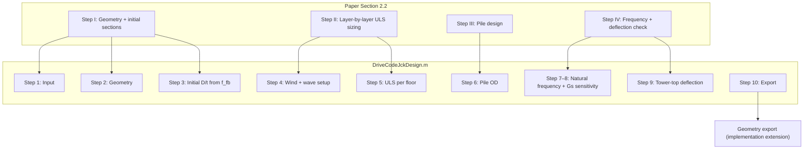

# Theory Reference — SCI Paper and Code Mapping

> This MATLAB project implements the methodology published in the peer-reviewed paper below.  
> **Related:** [DESIGN.md](DESIGN.md) · [REQUIREMENTS.md](REQUIREMENTS.md) · [USER_MANUAL.md](USER_MANUAL.md)

---

## 1. Primary Reference (Theory Manual)

| Field | Detail |
|-------|--------|
| **Title** | A preliminary design method for jacket support structures of high-capacity offshore wind turbines |
| **Authors** | Renqiang Xi, Haipeng Shan, Meiling Cheng, M. Hesham El Naggar, Xiuli Du |
| **Journal** | *Soil Dynamics and Earthquake Engineering* |
| **Volume / Article** | 207 (2026) 110344 |
| **DOI** | [10.1016/j.soildyn.2026.110344](https://doi.org/10.1016/j.soildyn.2026.110344) |
| **Received / Accepted** | 23 Sep 2025; revised 23 Mar 2026; accepted 18 Apr 2026 |
| **Local file** | [`A preliminary design method for jacket support structures of high-capacity offshore wind turbines.pdf`](A%20preliminary%20design%20method%20for%20jacket%20support%20structures%20of%20high-capacity%20offshore%20wind%20turbines.pdf) |
| **Original code repository (paper)** | [github.com/xirenqiang/Design-of-jacket-for-OWTs](https://github.com/xirenqiang/Design-of-jacket-for-OWTs) |

### 1.1 What the paper proposes

The paper presents a **systematic preliminary design framework** for **jacket offshore wind turbines (JOWTs)** in transitional water depths, featuring:

1. **Governing load cases** aligned with IEC 61400-3-1 / DNV practice (ETM, EOG, EWM, sea states).
2. **Top-down, layer-by-layer** variable cross-section member sizing with hydrodynamic loads in the loop.
3. **Equivalent stiffness** models for tapered jackets to verify **system natural frequency** and **tower-top deflection**.
4. **Quasi-static** extreme-value analysis with **DAF** on wave loads (computation typically **< 10 min** after data preparation).
5. Validation against **UpWind** and **INNWIND** reference designs.

This repository (`jacket_design_5MW`) is the **5 MW-class MATLAB implementation** of that methodology.

### 1.2 Suggested citation

```text
Xi, R., Shan, H., Cheng, M., El Naggar, M.H., Du, X., 2026.
A preliminary design method for jacket support structures of high-capacity offshore wind turbines.
Soil Dynamics and Earthquake Engineering 207, 110344.
https://doi.org/10.1016/j.soildyn.2026.110344
```

---

## 2. Paper Workflow ↔ Software Workflow



| Paper step | Paper section | Code step | Primary functions |
|------------|---------------|-----------|-------------------|
| Step I — geometry | §2.3 | Step 2 | `Geometry_jacket_3f/4f`, `height_wd_jac_floor_*` |
| Step I — initial sections | §2.3.4, Eqs (25)–(34) | Step 3 | Inline stiffness/frequency init, `Diameter_thickness_ini` |
| Step II — loads | §2.1, §2.4 | Step 4 | Inline ETM/EOG/EWM; `Hydro_load_*`, `Moment_Jac_wind` |
| Step II — ULS sizing | §2.5 | Step 5 | Inline loop; `sigma_allowable`, `Weight_jacket`, `Hydro_load_1and50yrs` |
| Step III — piles | §2.6 | Step 6 | `Diameter_pile` |
| Step IV — frequency | §2.7 | Steps 7–8 | `Distribute_mass_jacket`, `intergral_mode_shape`, soil spring inline |
| Step IV — deflection | §2.7 / SLS | Step 9 | Inline NTM + wave deflection |
| — | — | Step 10 | `member_export`, `node_export` (downstream FE handoff) |

---

## 3. Key Equations — Paper to Code

### 3.1 Jacket platform height — Paper Eq. (22)

**Paper:**

\[
h_J = S + H_{m,50} + 0.2 H_{s,50}
\]

**Code** (`DriveCodeJckDesign.m`):

```matlab
Zplatform = water_depth + Hm50 + 0.2*Hs50;
h_Jacket = ceil(Zplatform);
```

Uses `Hm50`, `Hs50` from input; `water_depth` corresponds to still-water level / seabed reference `S`.

---

### 3.2 Bottom width — Paper Eq. (24)

**Paper:**

\[
L_{bottom} = L_{top} + \sqrt{2}\, h_J \tan(\alpha_v)
\]

**Code:**

```matlab
L_bottom = L_top + sqrt(2)*h_Jacket*tand(av);
```

This matches the **published formula**. (Legacy `DriveCode_1.m` uses `2·h·tan(av)` — see [CODE_REVIEW.md M-01](CODE_REVIEW.md).)

---

### 3.3 Target frequency & initial stiffness — Paper Eqs (25)–(32)

| Paper symbol | Code variable | Location |
|--------------|---------------|----------|
| \(f_{fb}\) target | `f_fb_target = n_max/60*1.1` | Step 3 |
| \(EI_{TJ}\) | `EI_tj_target`, `EI_JacketTower` | Step 3, 7 |
| \(EI_T\) tapered tower | `EI_tower` via `fq`, `I_Tower_top` | Step 3 |
| \(EI_J\) jacket | `EI_Jacket`, `Itopj` | Step 3 |
| \(A_L\), \(A_b = 0.2 A_L\) | `Aleg`, `Abrace = 0.2*Aleg` | Step 3 |
| \(D_b/D_L = 0.4\) | `D_brace_ini = 0.4*D_leg_ini` | Step 3 |

Paper Eq. (25) fundamental frequency estimate is implemented in Step 7 as `f_fb` with updated member properties.

---

### 3.4 Wind load cases — Paper §2.1.1

| Case | Paper | Code |
|------|-------|------|
| **ETM** | Eqs (2)–(4), σ from IEC Kaimal spectrum | `sigmau_etm`, `u_etm`, `F_etm` — Step 4 |
| **EOG** | Eqs (5)–(7) | `u_eog`, `F_eog` — Step 4 |
| **EWM** | Parked / extreme wind | `F_ewm_6_1`, `F_ewm_6_3` with `Ct1=0.052` |

**Note:** Code comments say EOG formulation is conservative vs. exact IEC wording — consistent with paper's quasi-static simplification.

---

### 3.5 Sea state & DAF — Paper Eqs (20)–(21), (47)

| Quantity | Paper | Code |
|----------|-------|------|
| 1-yr \(H_{S,1}\) | \(0.8 H_{S,50}\) | `Hs1 = 0.8*Hs50` |
| Wave period | \(T = 11.1\sqrt{H/g}\) | `Tm1`, `Tm50`, `Tm2` |
| DAF | Eq. (47), damping ratio ξ | `DAF1`, `DAF50`, `DAF2` with **ξ = 0.05** (5% running) |

Paper recommends **5% damping for running**, **1% for parked** — code uses 0.05 in DAF denominator.

---

### 3.6 Morison hydrodynamics — Paper Eqs (44)–(45)

Distributed load per unit length (drag + inertia), integrated along submerged length:

**Code chain:** `Hydro_load_timehistory` → `Hydro_structure` → `Hydro_member1` → `Vel_fluid_particle` / `ACC_fluid_particle` → `Vel_resolve` / `ACC_resolve`

Partial submergence at free surface: discretization via `Discrete_bar` (`dL_ele_target = 3.0 m`), as in paper Fig. 7.

---

### 3.7 Member internal forces — Paper §2.5, Eqs (48)–(52)

| Paper | Code (Step 5) |
|-------|---------------|
| Combined wind + wave moment with direction factors β₁, β₂ | `M = 1.3*max(...)` with `pesai=45°` in brace axial `Fb = H/(cos(sitah)*cosd(pesai))` |
| Leg axial from moment + weight | `V1 = (1/Width)*(M/√2) + 1.3*Wnet/4` |
| Brace axial | `Fb = H/cos(sitah)/cosd(pesai)` — corresponds to Eq. (52) form |
| Self-weight + buoyancy | `Weight_jacket.m` — paper Eq. (46) |

Paper considers **four wind-wave direction scenarios** (0°, 90°, 45° offset, both at 45°). Code currently implements **one azimuth** (`pesai = 45°` hardcoded).

---

### 3.8 Allowable compression — Paper Eq. (53) / API

**Paper:** API tubular column curve; **μ = 0.8** recommended for the method.

**Code:** `sigma_allowable.m` — same short/long column branches with `fy=355 MPa`, capacity `/1.15`; **`k_leg=1.0`**, **`k_brace=0.8`**.

---

### 3.9 Pile capacity — Paper §2.6

**Paper:** API / DNVGL-RP-C212 simplified shaft friction (cohesionless Eq. 54, cohesive Eqs 56–58).

**Code:** `Diameter_pile.m` — iterative OD search using `wgh_soil`, `fs_limit`, `K0*tan(interface_angle)*σ_v`, capped friction.

---

### 3.10 System natural frequency — Paper §2.7

**Paper:** Equivalent jacket stiffness from stepped cantilever (Fig. 11, Eqs 59–60+); soil flexibility via foundation springs.

**Code:** Step 7 — closed-form `EI_Jacket` from leg areas; `f_fb` from Eq. (25) form; soil reduction via `Gs`, `k_pile`, `K_R`, `C_J` factor.

Step 8 sensitivity (±30% on `Gs`) is a **software extension** for parametric study.

---

## 4. Coordinate Systems

| System | Paper (Fig. 1) | Code internal (`Member`) | Code export |
|--------|----------------|--------------------------|-------------|
| Vertical axis | **z** (up, tower axis) | **Y** (up) | **Z** (SWL = 0) |
| Horizontal | **x** (east), **y** | **X**, **Z** | **X**, **Y** |
| Origin | MSL ∩ tower axis | Geometry origin at mudline/plan center | Shifted by `water_depth` |

Export mapping documented in [USER_MANUAL.md §9.3](USER_MANUAL.md) and [ARCHITECTURE.md §6](ARCHITECTURE.md).

---

## 5. Standards Referenced in the Paper

| Standard | Topics in paper |
|----------|-----------------|
| **IEC 61400-3-1** | Governing load case subset for substructure |
| **IEC 61400-1** | ETM turbulence, EOG gust |
| **DNV-OS-J101 / DNV GL-ST-0126** | Sea state, DAF, air gap, integral length scale |
| **API RP 2A** | Tubular member allowable stress (Eq. 53) |
| **DNVGL-RP-C212** | Pile capacity methods |

The software **implements paper formulas**, not a full automatic standards compliance checker. Engineering sign-off remains required.

---

## 6. Validation Cases in the Paper

The paper validates against reference designs from:

- **UpWind** project (5 MW and 10 MW class jackets)
- **INNWIND** project

Local regression scripts:

| Script | Relation to paper |
|--------|-------------------|
| `Validations/model/DriveCode_1.m` | End-to-end replica; should track production driver |
| `Validations/model/inputdata.dat` | 5 MW example input deck |

See [CODE_REVIEW.md §4](CODE_REVIEW.md) for current PASS/FAIL status.

---

## 7. Known Implementation Deviations from Paper

| Topic | Paper | This codebase | Severity |
|-------|-------|---------------|----------|
| Load directions | Four β scenarios (§2.5) | Single `pesai=45°` | **Approved plan:** `auto_envelope` D1–D4 by default, plus `single_direction` and `legacy_pesai`; see [PLAN_DIRECTIONAL_LOADS.md](PLAN_DIRECTIONAL_LOADS.md) |
| ULS resize | Systematic diameter increment | Fixed `D_leg=1.2`, `D_brace=0.6` on iteration | Critical — see CODE_REVIEW C-01 |
| EWM thrust coefficient | From turbine/parked model | `Ct1` hardcoded 0.052; input ignored | Major |
| Soil shear modulus | Site-specific | `Gs=15e6` hardcoded | Major |
| Floor loop | Top-down N layers | Fixed loop `i=1:4` | Major for 3-bay |
| Damping in DAF | 5% running / 1% parked | ξ=0.05 in all DAF calls | Minor |
| GitHub repo | Paper cites public repo | This repo is the maintained implementation | Info |

When auditing against the paper, treat the PDF as **method authority** and this table as **implementation delta**.

---

## 8. How to Use This Document

| Task | Read |
|------|------|
| Understand *why* a formula exists | PDF §2 + this doc §3 |
| Find *where* it is coded | This doc §2–3 + [DESIGN.md](DESIGN.md) |
| Check if code matches paper | This doc §7 + [CODE_REVIEW.md](CODE_REVIEW.md) |
| Run the tool | [USER_MANUAL.md](USER_MANUAL.md) |

---

## 9. Document History

| Date | Change |
|------|--------|
| 2026-05-21 | Created theory reference; linked SCI PDF; mapped paper sections to code; replaced placeholder `theory.pdf` references |
