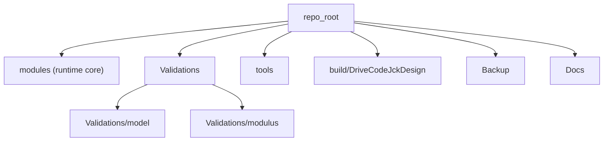

# Jacket Design 5MW User Manual

## 1. Introduction and Scope

This software is a preliminary design and validation toolkit for offshore wind jacket support structures.
The primary runtime entry point is `modules/DriveCodeJckDesign.m`.

The manual covers:

- Main software functions and workflow.
- Software architecture and design rationale.
- Input/output file specifications.
- Validation cases in `Validations/model` and `Validations/modulus`.
- Runtime methods:
  - Run from MATLAB by calling functions.
  - Build and run executable (`.exe`) with MATLAB Compiler.

This project is intended for engineering design study and verification workflows. It is not a certified design approval package by itself.

**Full documentation set:** see [Docs/README.md](README.md) for requirements, architecture, detailed design, and code review documents derived from the codebase.

## 2. Feature Overview

`DriveCodeJckDesign` executes the end-to-end design workflow, including:

- Input parsing from a user-provided data file.
- Jacket global geometry generation (3-bay / 4-bay).
- Initial member sizing and cross-section assignment.
- Extreme wind/wave/current load setup.
- Member strength checks and iterative resizing.
- Pile sizing.
- Frequency and sensitivity checks.
- Tower-top displacement evaluation.
- Geometry export to data files.

Input file example location:

- `Validations/model/inputdata.dat`

Main outputs are written to `Validations/model` (by current implementation), including geometry and runtime logs.

## 3. Software Architecture



Key directories:

| Directory | Purpose |
|-----------|---------|
| `modules/` | Runtime core: geometry, hydro, wind, structural checks, export |
| `Validations/model/` | Integrated validation scripts and canonical I/O artifacts |
| `Validations/modulus/` | Module-level unit/integration tests |
| `tools/` | Launch, build, encoding, and optional toolchain scripts |
| `build/DriveCodeJckDesign/` | MATLAB Compiler output (`.exe`, MCR readme, bundled input copy) |
| `Backup/` | Archived/non-runtime files kept for traceability |
| `Docs/` | User-facing documentation |

## 4. Design Rationale and Engineering Assumptions

Design principles used in the codebase:

- Keep runtime closure focused in `modules`.
- Separate integrated validation from module-level tests.
- Keep input/output artifacts under `Validations/model` for reproducibility.
- Maintain script-level usability (MATLAB interactive usage remains supported).

Current engineering assumptions reflected in code include:

- 3-bay or 4-bay four-leg jacket support structure flow only (`Num_floor` must be 3 or 4).
- Interactive sizing inputs for key member dimensions (`D_leg`, `t_leg`, `D_brace`, `t_brace`).
- Frequency-target-driven initialization and iterative strength checks.
- IEC 61400-1-style wind load approximations (ETM, EOG, EWM); verify against the standard before production use.
- Soil shear modulus `Gs` and jacket azimuth `pesai` are hardcoded in the driver (see Section 6.3).

Encoding and maintenance note:

- MATLAB `.m` files should be kept in **UTF-8 without BOM** according to project rules (`.cursor/rules/matlab-encoding-bulk-edits.mdc`).
- Optional pre-build script `tools/sanitize_runtime_strings.py` strips non-ASCII from runtime string literals for Compiler safety.

## 5. Computational Theory Reference

The theoretical basis of this software is the SCI paper:

**A preliminary design method for jacket support structures of high-capacity offshore wind turbines**  
Renqiang Xi, Haipeng Shan, Meiling Cheng, M. Hesham El Naggar, Xiuli Du — *Soil Dynamics and Earthquake Engineering* 207 (2026) 110344  
DOI: [10.1016/j.soildyn.2026.110344](https://doi.org/10.1016/j.soildyn.2026.110344)

| Resource | Location |
|----------|----------|
| Full paper (PDF) | [`Docs/A preliminary design method for jacket support structures of high-capacity offshore wind turbines.pdf`](A%20preliminary%20design%20method%20for%20jacket%20support%20structures%20of%20high-capacity%20offshore%20wind%20turbines.pdf) |
| Paper ↔ code mapping | [THEORY_REFERENCE.md](THEORY_REFERENCE.md) |

This user manual covers **implementation and usage**. Formula derivations, load-case selection rationale, and validation against UpWind/INNWIND cases should be read from the paper and theory reference.

## 6. Installation and Environment Requirements

### 6.1 Minimum environment

| Component | Requirement |
|-----------|-------------|
| OS | Windows (project paths and `.bat` launchers target Windows) |
| MATLAB | **R2018a** (hardcoded in `tools/*.bat`; validated locally) |
| Write access | `Validations/model/` (logs and exports); `build/DriveCodeJckDesign/` (build output) |

### 6.2 Executable build and distribution

| Component | Requirement |
|-----------|-------------|
| MATLAB Compiler | Required to build `.exe`; license checked in `tools/build_drivecode_exe.m` |
| MATLAB Runtime | **9.4** (R2018a); product IDs in `build/DriveCodeJckDesign/requiredMCRProducts.txt` |
| Build output | `build/DriveCodeJckDesign/DriveCodeJckDesign.exe` |

After recompiling, confirm the `.exe` timestamp is **newer than** `modules/DriveCodeJckDesign.m`. The executable embeds source at build time and does not auto-update when `.m` files change.

### 6.3 Configuring MATLAB path on another machine

Edit the `MATLAB_EXE` variable in:

- `tools/run_drivecode_matlab.bat`
- `tools/build_drivecode_exe.bat`

Example:

```bat
set "MATLAB_EXE=C:\Program Files\MATLAB\R2018a\bin\matlab.exe"
```

No environment-variable override is built in; edit the batch files or call MATLAB manually.

## 7. Design Workflow (10 Steps)

`DriveCodeJckDesign` runs the following sequence:

| Step | Description | Key functions / notes |
|------|-------------|----------------------|
| 1 | Load input parameters | `readData`, tower mass estimates |
| 2 | Jacket global geometry | `Geometry_jacket_3f` / `Geometry_jacket_4f`, `Bar_num_determine` |
| 3 | Initial member cross-sections | `Diameter_thickness_ini`; **interactive** leg/brace OD and wall thickness |
| 4 | Extreme wind and wave setup | ETM / EOG / EWM wind; `Hydro_load_1and50yrs`; starts `diary` log |
| 5 | Member strength (ULS) | Per-floor leg/brace capacity checks with iterative resizing |
| 6 | Pile sizing | `Diameter_pile` from ULS tension |
| 7 | Natural frequency | Combined tower+jacket frequency with soil flexibility |
| 8 | Frequency sensitivity | `Gs` scaled ±30% |
| 9 | Tower-top deflection (ULS) | Maximum deflection report |
| 10 | Export geometry | `member_export`, `node_export` → `.dat` files |

Console progress is printed as `Step N: ... -- finished.` Steps 4–10 are also captured in `Validations/model/session_output.txt`.

## 8. Input File Specification

### 8.1 File format

Parser: `modules/readData.m`

Rules:

1. **Line 1:** free-text comment (skipped).
2. **Data lines:** `<numeric_value>  <identifier>  #<comment>`
3. **Regex:** `^([\d\.\-eE]+)\s+(\w+)\s+#(.*)$`
4. Unmatched lines produce a MATLAB `warning` but do not stop execution.

Example:

```text
11.75  k_weibull  #Weibull scale parameter
4      Num_floor  #Number of layers in the jacket
```

### 8.2 Parameter dictionary

All parameters below are read from the input file unless noted in Section 8.3.

| Parameter | Unit / type | Description |
|-----------|-------------|-------------|
| `k_weibull` | — | Weibull scale parameter (wind) |
| `s_weibull` | — | Weibull shape parameter (wind) |
| `n_min` | rpm | Minimum turbine operating speed |
| `n_max` | rpm | Maximum turbine operating speed |
| `M_rna` | kg | Rotor–nacelle assembly mass |
| `D_Tower_top` | m | Tower top outer diameter |
| `D_Tower_bottom` | m | Tower bottom outer diameter |
| `m_t` | kg | Total tower mass |
| `h_Tower` | m | Tower height |
| `av` | deg | Jacket main-leg inclination angle |
| `Num_floor` | — | Jacket bay count; **must be 3 or 4** |
| `Num_pile` | — | Number of piles per leg group |
| `L_top` | m | Jacket top platform width |
| `water_depth` | m | Water depth |
| `Hs50` | m | 50-year significant wave height |
| `Hm50` | m | 50-year extreme wave height |
| `steel_density` | kg/m³ | Steel density |
| `E` | Pa | Young's modulus |
| `Mtp` | kg | Transition platform mass |
| `U_r` | m/s | Mean wind speed at hub height |
| `Ar` | m² | Rotor swept area |
| `air_density` | kg/m³ | Air density |
| `Lk` | m | Turbulence integral length scale |
| `I_ref` | — | Reference turbulence intensity at `U_r = 11.4 m/s` |
| `Lambda` | m | Turbulence length scale parameter |
| `U_ref` | m/s | 10-minute reference mean wind speed (Class I) |
| `z_hub` | m | Hub height |
| `Ct1` | — | **Read but ignored**; driver hardcodes `0.052` for EWM |
| `Hs2` | m | Wave height for EOG/ETM sea state |
| `density` | kg/m³ | Seawater density |
| `cd` | — | Hydrodynamic drag coefficient |
| `cm` | — | Hydrodynamic inertia coefficient |
| `S` | m | Water depth used in hydrodynamic calculations |
| `U_ss0` | m/s | Surface (steady) current speed at sea level |
| `U_ns0` | m/s | Near-bed (non-steady) current speed |
| `h_ref` | m | Reference depth for near-bed current profile |
| `L_pile` | m | Pile embedment length |
| `wgh_soil` | N/m³ | Soil unit weight (used in pile shaft capacity) |
| `fs_limit` | Pa | Soil shaft friction limit |
| `load_direction_mode` | — | `0=single_direction`, `1=auto_envelope` (default), `2=legacy_pesai` |
| `psi_site` | deg | Jacket installation azimuth for paper modes (default `0`) |
| `beta_wind` | deg | Wind direction for `single_direction` mode (default `0`) |
| `beta_wave` | deg | Wave/current direction for `single_direction` mode (default `45`) |
| `pesai_legacy` | deg | Structure–wave relative angle for `legacy_pesai` mode (default `45`) |
| `enable_directional_deflection` | flag | Enable Step 9 directional envelope when implemented (default `1`) |
| `delta_D_leg` | m | Leg OD increment during ULS resize (default `0.10`) |
| `delta_t_leg` | m | Leg wall thickness increment (default `0.005`) |
| `delta_D_brace` | m | Brace OD increment during ULS resize (default `0.06`) |
| `delta_t_brace` | m | Brace wall thickness increment (default `0.01`) |

Missing directional fields are filled by `build_design_config.m` defaults for backward compatibility with older input files.

Several fields in the sample file are marked “待补充” (TBD). Replace them with project-specific values before production runs.

### 8.3 Interactive and hardcoded parameters (not in input file)

**Interactive prompts (Step 3):**

After computing initial estimates, the driver prompts for:

- `D_leg` — jacket leg outer diameter (m)
- `t_leg` — jacket leg wall thickness (m)
- `D_brace` — brace outer diameter (m)
- `t_brace` — brace wall thickness (m)

Use the printed `D_leg_ini` / `D_brace_ini` suggestions as starting points, or enter project values directly.

**Hardcoded in `DriveCodeJckDesign.m`:**

| Symbol | Value | Notes |
|--------|-------|-------|
| `Ct1` | `0.052` | Overrides input-file `Ct1` for EWM thrust |
| `pesai` | `45` deg | Jacket plan azimuth; code errors if `pesai >= 90` |
| `dL_ele_target` | `3.0` m | Target hydrodynamic element length |
| `Gs` | `15e6` | Soil shear modulus for frequency analysis |
| `interface_angle` | `29` deg | Pile–soil interface friction angle |
| `K0` | `1.0` | Lateral earth pressure coefficient |
| Leg/brace iteration increments | `D_leg += delta_D_leg`, etc. from input | Step 5 resize (planned; `cfg` available from Step 1) |

### 8.4 Input path resolution

When calling `DriveCodeJckDesign(inputFile)`:

1. If `inputFile` exists as given, use it.
2. Else try `Validations/model/<inputFile>`.
3. Else error with both checked paths.

Relative examples (from repo root):

- `Validations\model\inputdata.dat`
- `inputdata.dat` (resolved via `Validations/model/` fallback)

## 9. Output Files and Coordinate System

### 9.1 Output location

All primary outputs are written under **`Validations/model/`**, regardless of where the input file resides or the current MATLAB working directory. The directory is created automatically if missing.

| File | Producer | Description |
|------|----------|-------------|
| `session_output.txt` | `diary` from Step 4 onward | Full console log for loads through export |
| `jacket_elements.dat` | `member_export` | Tab-separated member line elements |
| `node_coordinates.dat` | `node_export` | Tab-separated unique node coordinates |

Legacy artifacts (`output.txt`, `output_log.txt`, `output_results.txt`) may exist from older manual runs; the current driver does not regenerate them.

A copy of `inputdata.dat` may also appear under `build/DriveCodeJckDesign/` from the Compiler packaging step.

### 9.2 Export file schemas

**`jacket_elements.dat`** — tab-separated, header row included:

| Column | Unit | Description |
|--------|------|-------------|
| `ElementId` | — | Member index |
| `X0_m`, `Y0_m`, `Z0_m` | m | Start node (engineering axes) |
| `Xt_m`, `Yt_m`, `Zt_m` | m | End node (engineering axes) |
| `D_m` | m | Outer diameter |
| `t_m` | m | Wall thickness |

**`node_coordinates.dat`** — tab-separated, header row included:

| Column | Unit | Description |
|--------|------|-------------|
| `NodeIndex` | — | Unique node index |
| `X_m`, `Y_m`, `Z_m` | m | Node coordinates (engineering axes) |

### 9.3 Coordinate system mapping

Internal `Member` coordinates are mapped to engineering export axes as follows (`member_export.m`, `node_export.m`):

```
X_out = X_in
Y_out = Z_in
Z_out = Y_in - water_depth     (still water level at Z = 0)
```

A 3-D MATLAB figure is also displayed by `node_export` during Step 10.

## 10. How to Run

### 10.1 Run in MATLAB (recommended)

**Option A — root launcher (simplest):**

```matlab
cd('<project_root>');
run('run_DriveCodeJckDesign.m');
```

**Option B — call the function directly:**

```matlab
addpath('<project_root>/modules');
DriveCodeJckDesign();
```

The function will prompt:

`Enter input data file path (relative or absolute):`

Programmatic call (no path prompt):

```matlab
DriveCodeJckDesign('Validations/model/inputdata.dat');
```

### 10.2 One-click launch from Windows (MATLAB mode)

Run:

- `tools/run_drivecode_matlab.bat`

This changes to the repository root and executes `run_DriveCodeJckDesign.m`.

### 10.3 Build and run `.exe`

**Build:**

- MATLAB: `run('tools/build_drivecode_exe.m')`
- Windows batch: `tools/build_drivecode_exe.bat`

Build command (inside `build_drivecode_exe.m`):

```matlab
mcc('-m', entryFile, '-d', outputDir, '-v');
```

**Output directory:** `build/DriveCodeJckDesign/`

| Artifact | Purpose |
|----------|---------|
| `DriveCodeJckDesign.exe` | Standalone application |
| `readme.txt` | MCR deployment instructions (auto-generated) |
| `requiredMCRProducts.txt` | MCR product IDs (35000, 35010 → R2018a / 9.4) |
| `mccExcludedFiles.log` | Compiler exclusion log |

**Run the executable:**

1. Install MATLAB Runtime 9.4 (R2018a) if MATLAB is not installed.
2. Run `build/DriveCodeJckDesign/DriveCodeJckDesign.exe`.
3. Enter the input file path when prompted (same resolution rules as Section 8.4).
4. Check outputs under `Validations/model/` relative to the working directory at launch.

**Rebuild after code changes:** Editing `.m` files does not update an existing `.exe`. Re-run the build script and verify the new `.exe` timestamp.

## 11. Validation Cases

### 11.1 Integrated validation (`Validations/model`)

| Script | Status | Notes |
|--------|--------|-------|
| `DriveCode_1.m` | PASS | Full-workflow regression replica |
| `DriveCode_250401.m` | FAIL | Hardcoded external path to old project location |

Purpose: validate end-to-end workflow consistency across geometry, loading, sizing, and exports.

Canonical input: `Validations/model/inputdata.dat`

### 11.2 Module-level validation (`Validations/modulus`)

Representative scripts:

- `Test_current_vel.m`, `Test_Vel_fluid.m` — current and fluid kinematics
- `Test_coordinate.m`, `Test_y_coordinate.m` — coordinate transforms
- `Test_intergral_mode_shape.m` — mode-shape integration
- `Test_Member_Hydro*.m` — hydrodynamic member load tests

Purpose: verify local behavior of individual computational modules.

### 11.3 Running validations and interpreting results

**Integrated case:**

```matlab
cd('<project_root>/Validations/model');
DriveCode_1   % or run the script in the editor
```

**Module tests:**

```matlab
cd('<project_root>/Validations/modulus');
Test_current_vel   % example; run scripts individually
```

**Pass/fail matrix:** `Validations/validation_pass_fail_matrix.csv`

Last recorded summary: **14 PASS / 13 FAIL**. Common failure causes:

- Stale absolute paths (e.g. `DriveCode_250401.m`)
- API signature drift between test scripts and current module functions
- Incomplete or syntactically broken test scripts (`Test_Member_Hydro_sample0.m`)

Re-run failing scripts after fixes and update the CSV manually to track regression status.

## 12. Maintenance Tools (`tools/`)

| Script | Purpose |
|--------|---------|
| `run_drivecode_matlab.bat` | Launch MATLAB and run root launcher |
| `build_drivecode_exe.m` / `.bat` | Build standalone executable |
| `sanitize_runtime_strings.py` | Strip non-ASCII from runtime strings in `modules/*.m` |
| `restore_drivecode_from_j_drive.py` | Merge reference GBK source into UTF-8 `DriveCodeJckDesign.m` |
| `jacket_paths.properties` | Optional `REF_PATH=` for restore script |
| `check_toolchain.ps1` / `.bat` | Report local VS/Fortran/Python toolchain (optional; references external paths) |

Scripts referencing external projects (`patch_subdyn_ssi_decl_sections.py`, `sync_global_env.bat`) are not part of the core jacket design runtime.

## 13. FAQ

- **Q: Why do I see an input prompt every run?**  
  **A:** The input file path is intentionally required to avoid accidentally using wrong default files. Pass the path as a function argument to skip the prompt.

- **Q: Function not found (`DriveCodeJckDesign`)?**  
  **A:** Run `run_DriveCodeJckDesign.m` or `addpath('<project_root>/modules')`.

- **Q: Input file not found although the file exists?**  
  **A:** Use an absolute path first; then verify `Validations/model/` fallback (Section 8.4).

- **Q: Can this project run without MATLAB installed?**  
  **A:** Yes, using the compiled `.exe` and MATLAB Runtime 9.4 (R2018a).

- **Q: Does the `.exe` always reflect the latest source?**  
  **A:** No. Rebuild with `tools/build_drivecode_exe.bat` after code changes and check file timestamps.

- **Q: Why are outputs always under `Validations/model/`?**  
  **A:** The output root is hardcoded in `DriveCodeJckDesign.m` for reproducibility; it is not configurable from the input file.

- **Q: Why is `Ct1` in my input file ignored?**  
  **A:** The driver hardcodes `Ct1 = 0.052` for EWM calculations (Section 8.3).

- **Q: Why are some old files under `Backup`?**  
  **A:** They are archived/non-runtime files kept for traceability.

- **Q: Where is the theory document?**  
  **A:** The SCI paper PDF in `Docs/` and the mapping guide [THEORY_REFERENCE.md](THEORY_REFERENCE.md).

## 14. Appendix

### 14.1 Key files

| Role | Path |
|------|------|
| Main runtime | `modules/DriveCodeJckDesign.m` |
| Input parser | `modules/readData.m` |
| Design config | `modules/build_design_config.m` |
| Config smoke test | `Validations/model/Test_build_design_config.m` |
| Root launcher | `run_DriveCodeJckDesign.m` |
| MATLAB launcher (Windows) | `tools/run_drivecode_matlab.bat` |
| EXE build | `tools/build_drivecode_exe.m`, `tools/build_drivecode_exe.bat` |
| Compiled app | `build/DriveCodeJckDesign/DriveCodeJckDesign.exe` |
| Sample input | `Validations/model/inputdata.dat` |
| User manual | `Docs/USER_MANUAL.md` |
| Root readme | `README.md` |

### 14.2 Module index (by function)

| Group | Modules |
|-------|---------|
| Driver / I/O | `DriveCodeJckDesign.m`, `readData.m` |
| Geometry | `Geometry_jacket_3f.m`, `Geometry_jacket_4f.m`, `height_wd_jac_floor_3f.m`, `height_wd_jac_floor_4f.m`, `Bar_num_determine.m`, `Member_length.m`, `Direction_bar.m`, … |
| Sizing / strength | `Diameter_thickness_ini.m`, `Diameter_thickness_update.m`, `sigma_allowable.m`, `Weight_jacket.m`, `Diameter_pile.m` |
| Wind | `Moment_Jac_wind.m` (+ inline ETM/EOG/EWM in driver) |
| Hydrodynamics | `Hydro_member1.m`, `Hydro_structure.m`, `Hydro_load_1and50yrs.m`, `wave_number.m`, `Vel_fluid_particle.m`, `Current_vel.m`, … |
| Dynamics | `intergral_mode_shape.m`, `Distribute_mass_jacket.m` |
| Export | `member_export.m`, `node_export.m`, `cord_Cal.m` |

Globals used heavily at runtime: `Member`, `Hydro`, `Wave`, `Current`, `Discrete`, `dL_ele_target`.

### 14.3 Glossary

| Term | Meaning |
|------|---------|
| ULS | Ultimate Limit State |
| DAF | Dynamic Amplification Factor |
| RNA | Rotor–Nacelle Assembly |
| ETM / EOG / EWM | Extreme Turbulence Model / Extreme Operating Gust / Extreme Wind Model |
| MCR | MATLAB Compiler Runtime |
| SWL | Still Water Level |

### 14.4 Change log

| Date | Change |
|------|--------|
| 2026-05-21 | Expanded manual: 10-step workflow, input/output specs, coordinate mapping, validation runbook, build/rebuild notes, maintenance tools, FAQ; added root `README.md`. |
| 2026-05-21 | Step 1 directional config: `inputdata.dat` fields, `build_design_config.m`, driver cfg echo; smoke test `Test_build_design_config.m`. |
| (template) | `YYYY-MM-DD`: description of manual update. |
